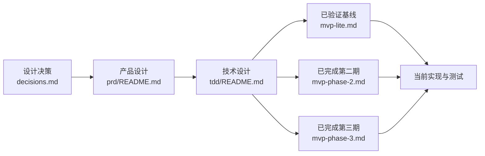

# Eidos Agent Runtime 文档

当前状态：早期设计与实施探索。MVP Lite、第二期 Runtime 基础与第三期“可扩展工具系统 v1”均已完成回归。目标态 PRD/TDD 仍是可演进草案，不代表清单外能力已经实现。

## 1. 文档全景

| 层级 | 回答的问题 | 状态与权威性 |
|---|---|---|
| [设计决策](decisions.md) | 已确认了哪些不可随意漂移的边界 | 决策记录；新决策可显式覆盖旧决策 |
| [目标态 PRD](prd/README.md) | 产品最终要解决什么问题、用户如何使用、如何验收 | 探索性目标态，不等于当前承诺 |
| [目标态 TDD](tdd/README.md) | 模块如何协作、协议和状态如何保证正确 | 探索性技术契约，不等于当前实现 |
| [MVP Lite](mvp-lite.md) | 已经跑通的最小闭环是什么 | 第一期实现与回归基线 |
| [第二期清单](mvp-phase-2.md) | 第二阶段具体交付了什么 | 第二期实现、回归与完成状态来源 |
| [第三期清单](mvp-phase-3.md) | 本地 Plugin、Skill、MCP Tools 与动态 Registry 交付什么 | 第三期实现、回归与完成状态来源 |

## 2. 推荐阅读顺序

1. 了解产品：先读 [PRD 总览](prd/README.md)，再按模块进入详细 PRD。
2. 了解架构：读 [TDD 总览](tdd/README.md)，再进入状态机、工具、模型、协议/事件/存储等模块。
3. 判断当前实现：以 [MVP Lite](mvp-lite.md)、[第二期清单](mvp-phase-2.md) 和 [第三期清单](mvp-phase-3.md) 的完成状态为准，不从目标态文档自行外推。
4. 追溯原因：需要知道“为什么这样设计”时查 [设计决策](decisions.md)。

## 3. 固定架构边界

- 本地控制面固定为 `Electron Main <-> Python Runtime` 的 stdio JSON-RPC 2.0；stdin/stdout 使用 JSONL，stdout 只承载协议，stderr 只承载安全日志。
- 本地不开放 HTTP、SSE、WebSocket、Unix Socket 或随机端口，不引入 FastAPI、Bearer Token 和本地代理控制面。
- Runtime 调用远端模型使用 HTTP 请求与 SSE 响应流；Provider 原始流先归一为内部事件，再进入 Item、Event 和 UI 投影。
- `Session -> Run -> Item/ToolCall`、Runtime 状态权威、Approval 与 Sandbox 分层是跨阶段稳定语义。
- 内置 Skill 随 Runtime 发布并部署到 `${EIDOS_DATA_DIR:-~/.eidos}/skills/.system`；用户 Skill 位于同级 `skills/<name>`，两者与 Plugin Skill 一起进入 Run 冻结快照。

## 4. 冲突处理

1. 当前阶段是否实施，以 `mvp-lite.md`、`mvp-phase-2.md` 和 `mvp-phase-3.md` 为准。
2. 产品语义以 PRD 为准；技术实现不能静默改变产品承诺。
3. 技术合同以 TDD 为准；当前代码与目标态不一致时，必须明确标注“当前实现”与“目标设计”。
4. 新确认决策与旧文档冲突时，先更新 `decisions.md`，再同步 PRD、TDD、验收与测试。

旧入口 `agent_runtime_mvp_prd.md` 与 `agent_runtime_mvp_tdd.md` 只保留链接兼容，不再承载重复正文。
