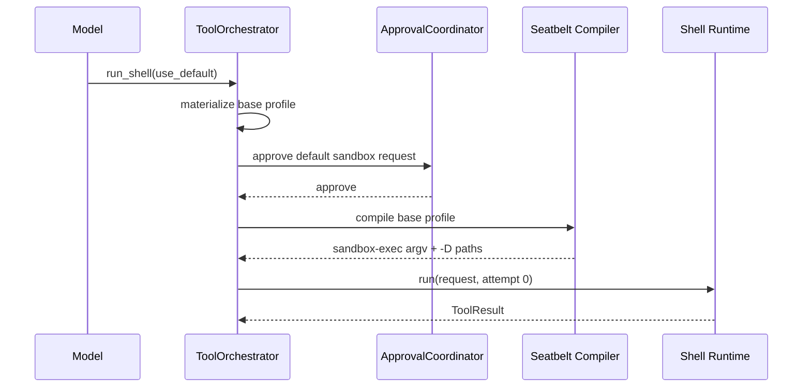
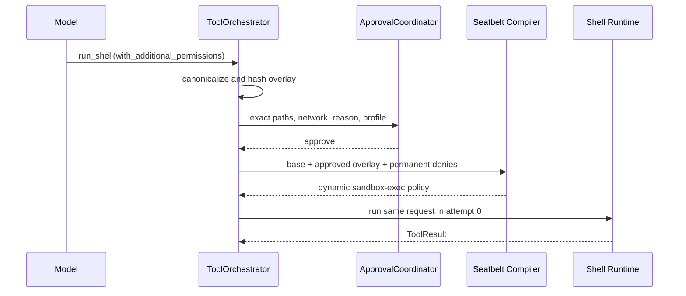
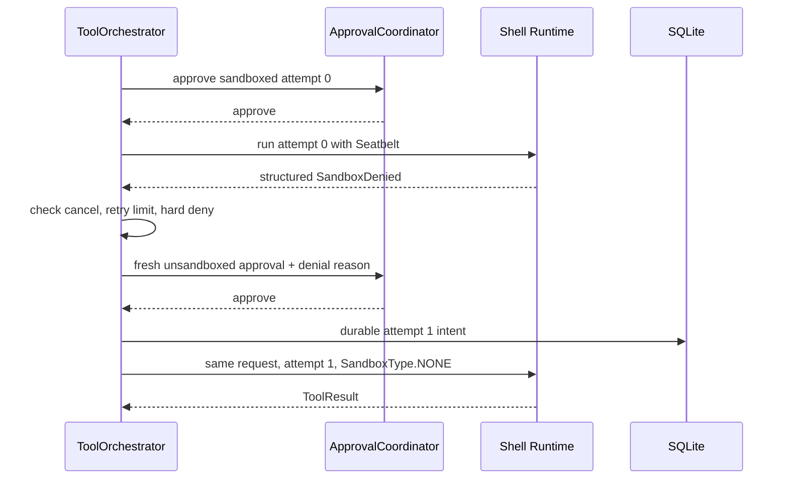
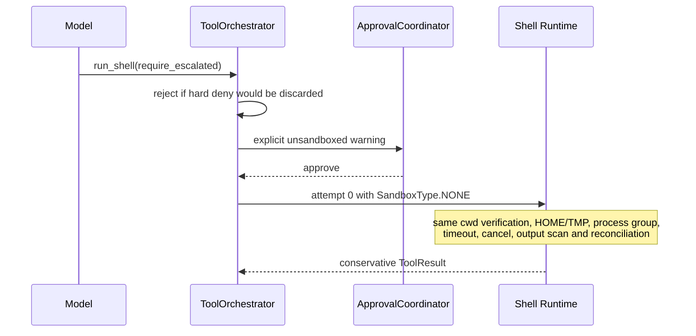

# Sandbox 权限升级与统一工具编排

状态：已实现（2026-07-29）
Eidos 基线：`7d6382bc50c43afd5cbeb6da4fbed649a56ab802`

本文描述 Shell 当前实现。它补充[工具、审批与沙箱](03-tools-approval-sandbox.md)，不改变 SQLite、`ApprovalCoordinator`、`ToolExecutionController`、`ResourceRegistry` 和 Workspace Guard 的既有权威。

## 1. Codex `main` 对照结论

实现前对照了当日 Codex `main` 的以下模块：

| Codex 模块 | 责任 |
|---|---|
| `core/src/tools/orchestrator.rs` | 集中执行 approval → sandbox selection → attempt → structured denial → optional retry；最多两次尝试 |
| `core/src/tools/sandboxing.rs` | `Approvable`、`Sandboxable`、`ToolRuntime`、`SandboxAttempt`、approval key/cache 与 unsandboxed 安全判断 |
| `core/src/tools/runtimes/unified_exec.rs` | 统一命令请求、approval key 和同一 runtime 的多次尝试 |
| `core/src/tools/runtimes/shell.rs` | Shell runtime 适配，不拥有通用 retry policy |
| `core/src/tools/runtimes/shell/unix_escalation.rs` | Unix 显式 escalation 的请求与约束 |
| `protocol/src/models.rs`、`protocol/src/permissions.rs` | `SandboxPermissions`、`AdditionalPermissionProfile` 和文件/网络权限 DTO |
| `sandboxing/src/manager.rs`、`policy_transforms.rs` | 集中选择 sandbox 并合并 additional permission profile |
| `sandboxing/src/denial.rs` | 保守识别结构化 sandbox denial |
| `sandboxing/src/seatbelt.rs` | macOS Seatbelt 启动与策略参数化 |

Eidos 借用职责分层，不机械移植 Rust。对应关系如下：

| 概念 | Eidos 所有者 |
|---|---|
| `ToolOrchestrator` | `runtime/tool_orchestrator.py`：权限物化、approval key、attempt 选择、一次 escalation |
| `ToolRuntime` | 通用 Python `Protocol`；本期由 `ShellOrchestrationRuntime` 接入 |
| `Sandboxable` | `sandbox_permissions()`、`additional_permissions()`、`workspace_roots()` |
| `Approvable` | `approval_requirement()`；实际审批状态仍只由 `ApprovalCoordinator` 管理 |
| `SandboxAttempt` | 闭合 Pydantic 模型，携带 sandbox 类型、effective profile、cwd、roots、hash 和原因 |
| `SandboxPermissions` | `use_default`、`with_additional_permissions`、`require_escalated` |
| `AdditionalPermissionProfile` | 文件 entry + 可继承的布尔网络开关 |
| `ExecApprovalRequirement` | `skip`、`needs_approval`、`forbidden` |
| `SandboxOverride` | Eidos 用 canonical `SandboxPermissions` 表达，不增加第二个 override 类型 |
| `SandboxErr::Denied` | `SandboxDenied(category, summary, evidence, originalExitCode)` |
| `SandboxManager` | 本期由 profile materializer + `SeatbeltPolicyCompiler` 共同承担；不进入 Shell handler |
| `ApprovalKey` | 绑定环境、请求、command、cwd、timeout、权限、workspace identity、attempt 和 profile hash |
| Managed Network | Eidos 本期只实现 Seatbelt broad boolean grant，不宣称域名级隔离 |

## 2. 所有权与调用链

```text
Model ToolCall
  -> RunShellInput closed validation
  -> ShellOrchestrationRuntime
  -> ToolOrchestrator
  -> ApprovalCoordinator
  -> EffectivePermissionProfile
  -> SandboxAttempt
  -> the same ShellOrchestrationRuntime.run()
  -> prepare_shell_launch()
  -> run_shell_process()
  -> canonical ToolResult
  -> ToolExecutionController terminal commit
```

固定所有权：

- `ToolExecutionController` 是 validation、deadline、Durable Intent、terminal persistence 和 reconciliation 的唯一生命周期所有者。
- `ApprovalCoordinator` 是等待、恢复、拒绝和取消的唯一审批状态机。
- `run_shell_process()` 是进程组、输出、timeout、cancel、SIGTERM/SIGKILL 和 `ResourceRegistry` 的唯一 supervisor。
- `ToolOrchestrator` 只决定权限、审批、attempt 和一次 retry；不直接 spawn、不写第二套生命周期。
- SQLite 是 approval、attempt、durable intent、ToolCall 和最终结果的唯一权威事实来源。

## 3. 权限模型

### 3.1 Base、overlay 与 effective profile

`BasePermissionProfile` 包含 workspace root、基础 entry、network 默认值、runtime roots、protected metadata、sandbox permanent deny、hard confidentiality deny 和 write-protected runtime roots。

`AdditionalPermissionProfile` 是模型提出、用户逐命令批准的请求，不是 grant。物化时：

1. 路径必须为绝对路径；
2. 路径必须存在；
3. 解析 symlink 并同时保留 requested/resolved path；
4. 对 canonical `(resolved path, access, recursive)` 去重；
5. 拒绝覆盖 Eidos state；
6. 拒绝写 Eidos runtime/策略源；
7. 合并后生成稳定 SHA-256 profile hash。

`write` 编译为 read + write；审计仍保留请求的 `write`。`execute` 编译为 read + `file-map-executable`。deny 在 allow 之后继续生效并具有优先权。

### 3.2 hard deny 与 soft restriction

两类限制有意分开：

- Permanent hard deny：保护不能因普通用户批准而丢弃的机密读取限制。只要 effective profile 含此类 deny，`unsandboxed_execution_allowed()` 就拒绝 Path B。
- Sandbox-only soft restriction：SQLite/approval state、Runtime 安装、策略源、`.git`、敏感文件等在 Seatbelt 内保持 deny 或 write deny；用户明确批准 unsandboxed 后，这些 Seatbelt 限制不再存在。

该取舍避免名义上的 hard deny 让 Path B 永久不可用。Path B 的风险由独立、醒目的 fresh approval 明示；它不是绕过 hard confidentiality deny 的通道。

## 4. 四条执行时序

### 4.1 默认 sandbox



### 4.2 `WithAdditionalPermissions`



### 4.3 sandbox denial 后升级



### 4.4 显式 `RequireEscalated`



## 5. Approval binding 与 retry

Shell approval hash包含：

- environment identity；
- canonical request/command；
- cwd 和 timeout；
- `SandboxPermissions` 与完整 additional profile；
- workspace dev/inode/uid 与 workspace roots；
- sandbox 类型、attempt ordinal、profile hash；
- escalation reason。

因此 sandboxed approval 不能授权 unsandboxed execution，旧路径集合不能授权新路径集合。Eidos 当前不缓存 session approval；sandbox denial 后必须创建 attempt 1 的全新 approval。每个 ToolCall 最多 attempt 0 和 attempt 1，普通 exit 1、编译错误、HTTP 错误和未知失败不会触发升级。

取消发生在两次 attempt 之间时，不启动 attempt 1。命令、cwd、权限或 workspace identity 变化会产生不同 approval key，并由现有 post-approval identity check 阻止执行。

## 6. Seatbelt 编译与环境

动态 policy 保留既有 `seatbelt.sbpl` bootstrap，并追加：

- 逐命令 read/write/execute mapping；
- approved runtime/toolchain roots；
- protected metadata 与 runtime write deny；
- permanent/hard deny；
- network boolean grant。

用户控制路径通过 `sandbox-exec -D` 传入，不拼接到 SBPL。`sandbox-exec` 使用绝对路径 `/usr/bin/sandbox-exec`；模板读取或编译失败时 fail closed，不自动尝试无沙箱。

两条路径使用同一受控环境：

```text
PATH
HOME = isolated Eidos shell home
TMPDIR = isolated Eidos temp
LANG
LC_ALL
GIT_OPTIONAL_LOCKS
PNPM_CONFIG_PM_ON_FAIL
```

不继承 SSH agent、proxy、云凭证或 package registry token。Unsandboxed 表示移除外层 Seatbelt，不表示继承宿主 secrets。

## 7. denial、审计与 reconciliation

`SandboxDenied` 只由 sandboxed attempt 的已知 `EPERM`/`EACCES` spawn error、Seatbelt/OS 拒绝签名和保守分类产生。任意非零退出码不是 denial。

SQLite schema 为每个 attempt 保存 sandbox 类型、是否请求 sandbox、effective permission JSON、profile hash、escalation reason、status、时间和 result code。每次 approval 另存 request JSON、attempt ordinal 和 approval kind。

Runtime 重启时：

- pending approval 失效，不能静默复用；
- running attempt 变为 `uncertain`；
- running Durable Intent 触发 `RECONCILIATION_REQUIRED`；
- 命令不自动重放。

`workspaceChangeState` 区分 `unchanged`、`changed`、`unknown`。manifest 不完整不再等价于 unchanged。Unsandboxed 进程一旦启动，`sideEffectsMayExist=true`；成功退出也不能证明外部文件、服务或远端状态未改变。

## 8. 与 Codex 的有意差异和当前限制

- Eidos 对 unsandboxed retry 始终要求 fresh approval；尚无 session approval cache。
- Eidos network grant 当前是 Seatbelt boolean broad grant，不是域名级 Managed Network Proxy。
- 本期只有 Shell 连接统一 Orchestrator；接口可供 MCP、Installer 和文件工具后续接入，但本期不迁移它们。
- 仅实现 macOS Seatbelt 与 `SandboxType.NONE`；Windows/Linux sandbox 不在本期。
- 外部路径 approval 绑定 canonical resolved path；UI 和审计展示 effective path，不宣称对同用户恶意 TOCTOU 的完整防护。
- Unsandboxed 仍保留受控环境和 Eidos supervisor，但外部文件、网络与宿主状态只能保守标记，不能由 workspace manifest 完整观测。
