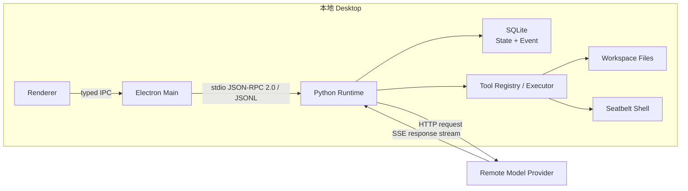
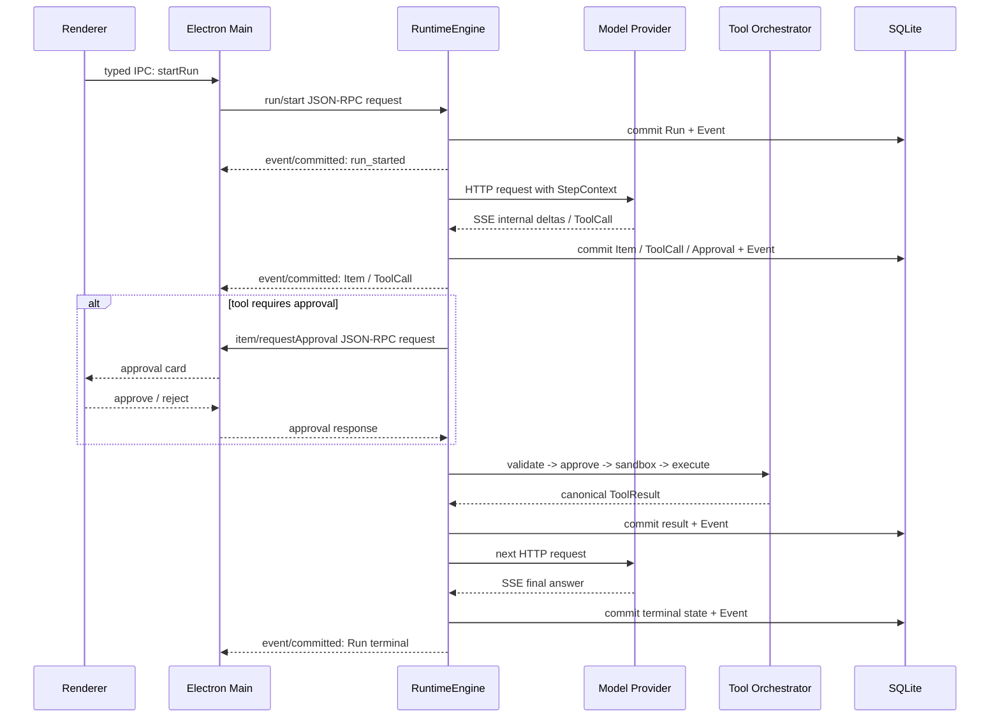
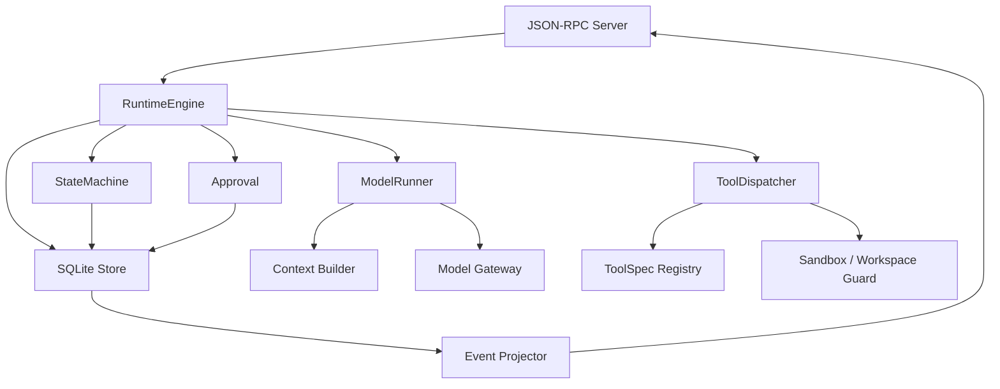

# Eidos Agent Runtime 目标态 TDD

版本：v0.4（探索草案）

本 TDD 描述目标技术设计和长期约束，不代表当前代码已经实现。当前架构以 [当前架构](../../../current-architecture.md)、代码和测试为准；旧阶段记录已归档到 [`archive/phases/`](../../phases/README.md)。

## 1. 系统全景



固定边界：

- 本地控制面只有标准 JSON-RPC 2.0 over stdio/JSONL；不开放本地 HTTP、SSE、WebSocket、Unix Socket 或随机端口。
- Main 是 Runtime 的唯一父进程和客户端；stdout 只承载协议，stderr 只承载安全日志。
- Runtime 调用远端模型使用 HTTP 请求与 SSE 响应流；Provider 原始事件不得直达 Renderer。
- Runtime 是 Session、Run、Item、ToolCall、Approval 和 Event 的状态权威，Renderer 只是投影。

## 2. 一次 Run 的主时序



## 3. 模块关系



依赖方向必须保持：Transport 只做收发；RuntimeEngine 只做协调；状态机决定合法迁移；Storage 原子提交事实；Event 层只投影已提交事实；工具和模型 Adapter 不直接写 UI payload。

## 4. 模块文档

| 模块 | 核心职责 | 输入/输出 | 详细设计 |
|---|---|---|---|
| Process & Trust Boundary | 进程、stdio、初始化、单实例和信任边界 | JSON-RPC envelope、capability handshake | [总体架构](01-architecture.md) |
| Runtime & StateMachine | Run 队列、Step、暂停、取消、终态与恢复 | command/domain event → legal state transition | [Runtime、队列与状态机](02-runtime-state-machine.md) |
| Tool Orchestrator | ToolSpec、参数、审批、沙箱、执行与结果 | effective arguments → canonical ToolResult | [工具、审批与沙箱](03-tools-approval-sandbox.md) |
| Sandbox Execution | Base/overlay profile、动态 Seatbelt、attempt、升级和审计 | permission request → approved SandboxAttempt | [Sandbox 权限升级与统一工具编排](08-sandbox-permission-orchestration.md) |
| Model & Context | StepContext、HTTP/SSE Adapter、上下文和流归一化 | local facts → model request/internal events | [模型、上下文与流式输出](04-model-context-streaming.md) |
| Protocol / Event / Storage | JSON-RPC 方法、闭合 DTO、Event、水位和 SQLite | request/fact ↔ result/notification/snapshot | [协议、事件与存储](05-api-events-storage.md) |
| Desktop | Main、Preload、Renderer、审批 UI 和生命周期 | typed IPC ↔ validated JSON-RPC | [桌面端安全与生命周期](06-desktop-security-lifecycle.md) |
| Verification | 单元、集成、崩溃注入、协议 fixture 和里程碑 | invariants → executable checks | [测试与里程碑](07-testing-and-milestones.md) |

## 5. 从 Codex 借鉴的边界

[Codex 技术架构参考](../../references/codex-technical-architecture.md) 只作为能力地图；Eidos 的阶段清单、协议和安全合同优先，不能把参考文档中的产品规模直接变成需求。

借鉴：

- 本地 sidecar 是稳定 Runtime boundary，UI 不实现 Agent Loop。
- 双向 RPC 支持 Runtime 主动发起审批；通知只承载 Item/Event 生命周期。
- 模型事件先归一为内部事件，再映射客户端协议。
- ToolSpec Registry 统一模型可见定义与本地执行入口；审批与沙箱属于单一调度链。
- 每个模型 Step 捕获不可变 StepContext，保证模型看到的工具、策略和实际执行视图一致。
- 协议 schema 与 Runtime 版本绑定，由闭合模型和 fixture 共同验证。

第三期只把 Codex 的“能力来源 -> 注册表 -> Step 快照 -> 单一调度链”原则用于本地 Plugin/Skill/stdio MCP Tools v1；不复制其市场、多传输、并行、多 Agent、Worktree 编排和 JSONL 历史规模。

Codex 的项目级指令可作为 Context Builder 的后续候选：第一版最多读取 active root 下一个有大小上限的 `AGENTS.md`，按确定顺序放入 StepContext；只有进入后续阶段清单时才实施，不提前复制多层配置体系。

## 6. 跨模块不变量

- 安全能力故障时 fail closed，不降级为无沙箱 Shell。
- 规范化业务表是当前状态来源；Event 是同事务写入的追加式 Timeline/Outbox。
- 多个 Run 可以存在，但模型调用和工具执行由一个持久 FIFO 执行器串行调度。
- 有副作用操作不自动重放；失败后先核验事实，再允许下一次变更。
- 不可信内容在截断、展示、模型观察和持久化之前经过同一版本化敏感规则。
- ToolCall 只消费已校验的 effective arguments；Approval 不能修改参数或放宽 Sandbox。
- ToolCall 保存唯一 canonical ToolResult；Context 和 UI 只生成有界投影，不创建第二个结果事实。
- 模型原始 reasoning 不进入持久化或 UI；文本只分为 `assistant_progress` 与 `final_answer`。
- 未进入阶段清单的目标态合同不能驱动当前实现扩项。

## 7. 第三期扩展边界

```text
Extension Catalog snapshot
  -> ToolRegistrySnapshot(ToolSpec + Adapter + provenance)
  -> StepToolSnapshot(direct + deferred + activated + hashes)
  -> ModelRunner(explicit model-visible definitions)
  -> ToolDispatcher(one entry, one ordered approval/sandbox/result path)
```

Plugin/Skill/MCP 生命周期属于 Python Runtime；Electron Main 只负责目录选择、类型化 RPC 与用户 consent/approval。MCP stdio 是 Runtime 到外部 Server 的内部连接，不是新的 Eidos 控制面。
