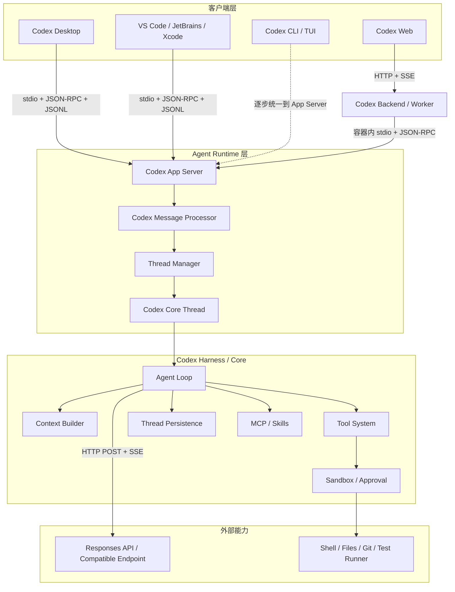
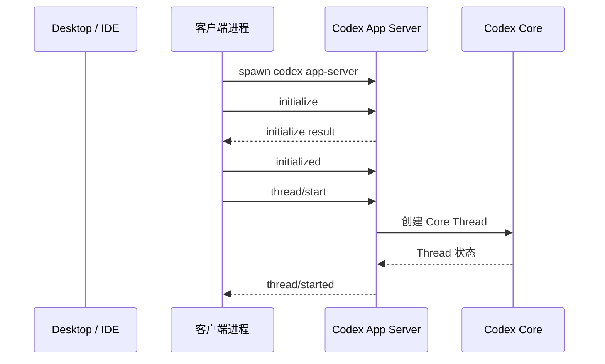
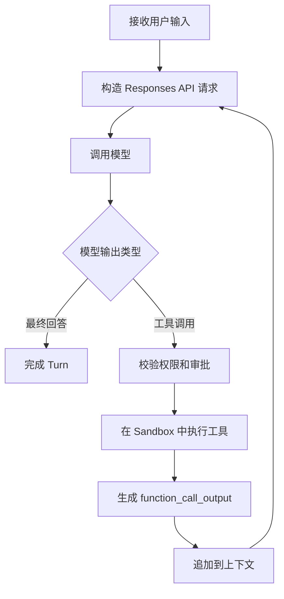

# Codex 技术架构整理

> 更新日期：2026-07-16  
> 资料范围：OpenAI 官方文档、官方技术文章与 `openai/codex` 开源仓库。  
> 说明：本文重点描述公开可确认的 Codex Runtime、App Server、Agent Loop 与客户端通信架构。Codex 桌面客户端的完整 UI 技术栈并未全部公开，因此不对其具体前端框架作推测。

## 1. 核心结论

Codex 并不是单一的“桌面聊天应用”，而是一套由多个客户端复用的 Agent Runtime 架构：

```text
Codex Desktop / IDE / CLI / Web Runtime
                    │
                    │ JSON-RPC
                    ▼
             Codex App Server
                    │
                    ▼
               Codex Core
        ┌───────────┼───────────┐
        │           │           │
        ▼           ▼           ▼
   Agent Loop    Tool System   Thread State
        │           │
        │           ▼
        │      Sandbox / Approval
        │
        ▼
 Responses API / Compatible Model Endpoint
```

其最关键的分层原则是：

- **客户端到本地 Runtime**：默认采用 `stdio + JSON-RPC Lite + JSONL`。
- **Runtime 到模型服务**：采用 `HTTP + Responses API + SSE`。
- **浏览器到 Codex 云端后端**：采用 `HTTP + SSE`。
- **本地执行环境**：由 Codex Core 负责工具调用、沙箱、审批、会话持久化和上下文管理。
- **不同客户端复用同一套 Harness**：桌面端、IDE、Web Runtime 和未来重构后的 TUI 均可通过 App Server 驱动同一个 Codex Core。

---

## 2. 总体架构



---

## 3. 核心组件

### 3.1 客户端层

Codex 支持多种产品形态：

| 客户端 | 主要职责 |
|---|---|
| Codex Desktop | 多项目、多线程、多 Agent 管理，展示执行过程、Diff、审批和产物 |
| IDE Extension | 在编辑器内驱动 Codex，展示流式进度、文件修改和审批 |
| Codex CLI / TUI | 在终端中运行 Codex |
| Codex Web | 在浏览器中提交和管理云端 Agent 任务 |
| 第三方客户端 | 通过 App Server 协议集成 Codex Harness |

客户端主要负责：

- 用户交互
- Thread、Turn、Item 的 UI 展示
- 流式事件渲染
- Diff 和工具执行结果展示
- 审批请求处理
- 项目和工作区管理

客户端不应重新实现 Agent Loop，而是通过 App Server 驱动 Codex Core。

---

### 3.2 Codex App Server

App Server 同时是：

1. 一个长期运行的本地子进程；
2. 一套面向客户端的双向 JSON-RPC 协议；
3. Codex Core 与 UI 之间的协议适配层。

根据 OpenAI 官方公开架构，App Server 包含四个主要部分：

```text
stdio reader
    ↓
Codex message processor
    ↓
Thread manager
    ↓
Codex core threads
```

各部分职责如下：

| 组件 | 职责 |
|---|---|
| stdio reader | 从标准输入读取 JSONL 消息，并向标准输出写回协议消息 |
| Codex message processor | 将 JSON-RPC 请求转换为 Codex Core 操作，并将内部事件转换为稳定的客户端通知 |
| Thread manager | 查找、创建和管理多个 Core Thread |
| Core Thread | 管理一个具体 Codex Thread 的 Agent Loop、上下文与运行状态 |

一个 App Server 进程可以托管多个 Thread。每个 Thread 通常对应一个独立的 Codex Core 会话。

---

### 3.3 Codex Core / Harness

Codex Core 是 Agent 能力的主体，主要负责：

- Agent Loop
- 模型调用
- Prompt 和上下文构造
- Thread 生命周期与持久化
- 工具注册和执行
- Shell、文件、Git 等本地能力
- MCP Server 和 Skill 集成
- Sandbox 与 Approval
- 自动上下文压缩
- 配置和认证状态

公开的 `openai/codex` 仓库主要以 Rust 实现，App Server 和 Codex Core 也位于该代码库中。

---

## 4. 进程模型

### 4.1 本地桌面端和 IDE

本地客户端通常会：

1. 随客户端打包或下载平台对应的 Codex 二进制；
2. 将版本固定到经过客户端验证的版本；
3. 启动长期运行的 `codex app-server` 子进程；
4. 保持双向 stdin/stdout 通道；
5. 通过 JSON-RPC 请求、响应和通知驱动 Agent；
6. 在客户端关闭时管理子进程退出。



这种结构的特点是：

- Runtime 生命周期与本地客户端容易绑定；
- 不需要默认监听 TCP 端口；
- 客户端与 Runtime 之间具备完整双向通信；
- Runtime 可以独立于具体 UI 框架演进；
- 多种客户端可以复用同一套 Agent Harness。

---

### 4.2 Codex Web

Codex Web 使用相同的 Harness，但 Runtime 运行在云端容器中：

```text
Browser
   │
   │ HTTP + SSE
   ▼
Codex Backend
   │
   ▼
Worker
   │
   ▼
Container
   │
   │ stdio + JSON-RPC
   ▼
Codex App Server
   │
   ▼
Codex Core
```

典型过程：

1. Worker 创建包含代码仓库的容器；
2. 在容器内启动 App Server；
3. Worker 与 App Server 保持长期 JSON-RPC 通道；
4. 浏览器通过 HTTP 提交操作；
5. 后端通过 SSE 向浏览器推送任务事件；
6. Thread 状态保存在服务端，因此浏览器关闭后任务仍可继续。

这里体现了 Codex 的分层原则：

- 浏览器边界使用网络协议；
- Runtime 内部仍复用 App Server；
- Agent 状态由服务端维护，而不是依赖浏览器页面。

---

## 5. 通信协议

### 5.1 JSON-RPC Lite

Codex App Server 使用一种简化版 JSON-RPC：

- 保留 Request、Response 和 Notification 结构；
- 线上消息省略 `"jsonrpc": "2.0"` 字段；
- stdio 默认使用 JSONL 分帧；
- 每行是一条完整 JSON 消息。

请求示例：

```json
{
  "method": "thread/start",
  "id": 10,
  "params": {
    "model": "gpt-5.4"
  }
}
```

成功响应：

```json
{
  "id": 10,
  "result": {
    "thread": {
      "id": "thr_123"
    }
  }
}
```

通知：

```json
{
  "method": "turn/started",
  "params": {
    "turn": {
      "id": "turn_456"
    }
  }
}
```

---

### 5.2 双向通信

App Server 协议不是普通的“客户端请求、服务端响应”。

它支持：

- Client → Server Request
- Server → Client Response
- Server → Client Notification
- Server → Client Request
- Client → Server Response

这对于 Agent 非常重要，因为服务端可能主动要求客户端处理审批：

```text
Client                    App Server
   │                           │
   │ turn/start                │
   ├──────────────────────────>│
   │                           │
   │ item/started              │
   │<──────────────────────────┤
   │                           │
   │ requestApproval           │
   │<──────────────────────────┤
   │                           │
   │ allow / deny              │
   ├──────────────────────────>│
   │                           │
   │ item/completed            │
   │<──────────────────────────┤
```

在客户端回复之前，对应 Turn 可以暂停执行。

---

### 5.3 支持的传输

截至文档更新时，App Server 支持：

| 传输方式 | 状态 | 用途 |
|---|---|---|
| `stdio://` | 默认、正式支持 | 本地桌面端、IDE、本地子进程 |
| `ws://IP:PORT` | 实验性、官方标记为 unsupported | 远程 TUI、开发调试 |
| `unix://` | 支持 | 本地 Unix Socket 控制通道 |
| `off` | 支持 | 不暴露本地传输 |

默认方案是：

```text
stdio + JSON-RPC Lite + JSONL
```

WebSocket 不应被视为默认生产传输；远程使用时还需要 TLS 和认证。

---

## 6. 会话数据模型

Codex 使用三层核心抽象：

```text
Thread
  └── Turn
        └── Item
```

### 6.1 Thread

Thread 是一个持久化的 Agent 会话容器。

它可以：

- 创建
- 恢复
- Fork
- 归档
- 持久化历史
- 在客户端重连后恢复时间线

一个 Thread 包含多个 Turn。

---

### 6.2 Turn

Turn 是由一次用户输入触发的一轮 Agent 工作。

例如：

```text
用户：运行测试并修复失败用例
        ↓
模型推理
        ↓
执行测试
        ↓
读取错误
        ↓
修改代码
        ↓
再次运行测试
        ↓
输出最终结果
```

整个过程属于同一个 Turn，但内部可能包含多次模型调用和多个工具执行。

---

### 6.3 Item

Item 是 Codex 协议中的最小输入输出单元，例如：

- 用户消息
- Agent 消息
- Reasoning
- Tool Call
- Command Execution
- Tool Result
- Approval Request
- File Change
- Diff

Item 有明确的流式生命周期：

```text
item/started
item/*/delta
item/completed
```

因此客户端可以：

1. 在 `item/started` 时立即创建 UI 卡片；
2. 在 `item/*/delta` 时增量更新内容；
3. 在 `item/completed` 时固定最终状态。

相比只传递文本 Token，这种结构更适合展示完整 Agent 执行轨迹。

---

## 7. Agent Loop

Codex Agent Loop 可以概括为：



详细步骤：

1. 接收用户输入；
2. 加载模型指令、项目规则和工具描述；
3. 构造 Responses API 的 `instructions`、`tools` 和 `input`；
4. 通过 HTTP POST 请求模型服务；
5. 消费模型返回的 SSE 事件流；
6. 将模型事件转换为 Codex 内部事件；
7. 如果模型发起工具调用，则进入审批和沙箱执行；
8. 将工具结果作为 `function_call_output` 追加到上下文；
9. 再次调用模型；
10. 重复执行，直到模型输出最终 Assistant Message；
11. 完成当前 Turn。

---

## 8. 模型调用与事件转换

### 8.1 Runtime 到模型服务

Codex Core 通过 Responses API 调用模型：

```text
Codex Core
    │
    │ HTTP POST /responses
    ▼
Model Endpoint
    │
    │ SSE
    ▼
Codex Core
```

模型端点是可配置的，可以是：

- ChatGPT 登录对应的 Codex Responses Endpoint；
- OpenAI API 的 `/v1/responses`；
- 兼容 Responses API 的云厂商端点；
- Ollama 或 LM Studio 等本地兼容端点。

---

### 8.2 SSE 事件

Responses API 会返回类似以下事件：

```text
response.reasoning_summary_text.delta
response.output_item.added
response.output_text.delta
response.completed
```

Codex Core 不会简单地把原始 SSE 数据直接透传给客户端，而是执行一层转换：

```text
Responses API Event
        ↓
Codex Internal Event
        ↓
App Server Item / Turn Event
        ↓
Desktop / IDE UI
```

例如：

```text
response.output_text.delta
        ↓
Agent Message Item Delta
```

这层转换的价值包括：

- UI 不直接依赖模型供应商协议；
- 不同模型端点可以共享统一客户端协议；
- 工具、审批、Diff 和文件修改可以使用统一事件模型；
- App Server 可以保持面向 UI 的协议稳定性。

---

## 9. 上下文构造

Codex 发送给模型的内容不只有用户问题，还包括多种上下文：

```text
模型基础指令
+ 用户自定义模型指令
+ Sandbox 和 Approval 权限说明
+ 环境信息
+ 当前工作目录
+ AGENTS.md
+ AGENTS.override.md
+ Skills
+ Tool Schemas
+ MCP Tools
+ 历史消息
+ 历史 Tool Call
+ 历史 Tool Result
+ 用户当前输入
```

### 9.1 项目指令

Codex 会读取：

- `$CODEX_HOME` 中的 `AGENTS.md` 或 `AGENTS.override.md`；
- 从项目根目录到当前目录路径上的项目说明文件；
- 配置指定的备用项目说明文件。

更靠近当前工作目录的规则可以提供更具体的项目约束。

---

### 9.2 Prompt Cache

Codex 会尽量让后续请求保留前一次请求的稳定前缀：

```text
旧请求输入
+ 新的模型输出
+ Tool Call
+ Tool Result
+ 新用户输入
```

保持稳定前缀有利于 Prompt Cache 命中。

容易破坏缓存前缀的变化包括：

- 中途改变 Tool 列表；
- 中途切换模型；
- 修改 Sandbox 或 Approval 配置；
- 修改当前工作目录；
- MCP Server 动态改变工具列表。

---

### 9.3 上下文压缩

随着对话和工具结果不断累积，Prompt 会持续增长。

Codex 在超过自动压缩阈值后，会使用专门的 `/responses/compact` 能力压缩历史上下文，并用压缩结果继续后续对话。

公开技术文章说明，Codex 当前倾向保持模型请求可独立重建，而不是完全依赖 `previous_response_id`。这样有利于：

- 请求无状态化；
- 支持 Zero Data Retention 场景；
- 更容易接入兼容 Responses API 的不同端点；
- 客户端或 Runtime 重建上下文。

---

## 10. 工具系统

Codex 的 Tool 来源主要包括：

| 来源 | 示例 |
|---|---|
| Codex 内置工具 | Shell、Plan、文件操作 |
| Responses API 工具 | Web Search 等服务端工具 |
| MCP Server | 用户配置的外部工具 |
| Skills | 指令、脚本和资源组成的可复用工作流 |

工具调用基本流程：

```text
模型输出 function_call
        ↓
Codex 解析 Tool Call
        ↓
权限和审批判断
        ↓
Sandbox 中执行
        ↓
收集 stdout / stderr / exit code
        ↓
生成 function_call_output
        ↓
继续调用模型
```

Codex Core 负责工具编排，客户端主要负责展示和审批交互。

---

## 11. Sandbox 与 Approval

Codex 将安全控制拆成两个独立层：

| 机制 | 作用 |
|---|---|
| Sandbox | 从操作系统层面定义 Agent 技术上能够访问什么 |
| Approval | 定义 Agent 在什么情况下必须暂停并请求许可 |

二者关系：

```text
Sandbox：能力边界
Approval：越过边界前的决策机制
```

审批并不等价于沙箱。即使用户批准某个动作，Runtime 仍需要按照实际权限策略执行。

---

### 11.1 平台沙箱

根据官方文档：

| 平台 | 主要机制 |
|---|---|
| macOS | 系统内置 Seatbelt |
| Linux | bubblewrap |
| WSL2 | Linux Sandbox / bubblewrap |
| Native Windows | Windows 原生 Sandbox |

沙箱不仅作用于内置文件操作，也作用于 Codex 启动的子进程，例如：

- `git`
- `go test`
- `cargo test`
- `npm`
- `pnpm`
- 编译器
- 测试运行器
- Shell 脚本

这些子进程继承相同的沙箱边界。

---

### 11.2 常见沙箱模式

| 模式 | 行为 |
|---|---|
| `read-only` | 允许读取，修改文件或运行部分命令需要更高权限 |
| `workspace-write` | 允许在当前工作区内读写，并运行常规本地命令 |
| `danger-full-access` | 取消文件系统和网络沙箱限制 |

### 11.3 常见审批策略

| 策略 | 行为 |
|---|---|
| `untrusted` | 非可信命令需要审批 |
| `on-request` | 在沙箱内自主执行，越界时请求审批 |
| `never` | 不暂停等待审批 |

较典型的低摩擦本地配置是：

```toml
sandbox_mode = "workspace-write"
approval_policy = "on-request"
```

---

## 12. 多 Agent 与 Git Worktree

Codex Desktop 的多 Agent 能力基于独立 Thread 组织。

```text
Project
  ├── Thread A
  ├── Thread B
  └── Thread C
```

为了让多个 Agent 并行修改同一仓库，Codex App 支持 Git Worktree：

```text
Repository
  ├── Main Working Tree
  ├── Worktree A → Agent A
  ├── Worktree B → Agent B
  └── Worktree C → Agent C
```

每个 Agent 可以拥有：

- 独立 Thread；
- 独立上下文；
- 独立 Turn 序列；
- 独立工作目录；
- 独立文件修改；
- 独立执行流和审批状态。

Worktree 解决的是代码工作目录隔离问题；Sandbox 解决的是操作系统权限边界问题，两者职责不同。

---

## 13. 状态与持久化

公开资料可以确认，Codex Harness 负责 Thread 生命周期和事件历史持久化。

持久化的目标是：

- 客户端重启后恢复 Thread；
- 支持 Thread Resume；
- 支持 Thread Fork；
- 支持 Thread Archive；
- 客户端重连后重建一致时间线；
- Web 页面断开后任务继续运行；
- 多个客户端使用同一套会话语义。

客户端不是 Agent 状态的唯一事实来源。

---

## 14. Desktop、CLI 与 Web 的架构差异

| 维度 | Desktop / IDE | CLI / TUI | Codex Web |
|---|---|---|---|
| Runtime 位置 | 用户本机 | 用户本机或远程机器 | 云端容器 |
| Client → Runtime | stdio JSON-RPC | 当前存在直接 Core 调用，官方计划统一到 App Server | Worker → App Server 使用 stdio JSON-RPC |
| Browser / UI 网络层 | 无需默认开放本地 HTTP | 无 | Browser → Backend 使用 HTTP + SSE |
| 文件和命令执行 | 本地 Sandbox | 本地 Sandbox | 云端 Sandbox |
| 状态恢复 | 本地 Thread 持久化 | 本地 Thread 持久化 | 服务端持久化 |
| 长任务断连 | 依赖本地进程生命周期 | 依赖运行机器 | 浏览器关闭后可继续 |

---

## 15. Codex 为什么采用这种架构

### 15.1 本地边界使用 stdio JSON-RPC

优势：

- 不需要默认开放本地端口；
- 子进程生命周期容易管理；
- 支持真正的双向请求；
- 适合流式事件和审批；
- 支持多语言客户端；
- 客户端和 Runtime 解耦；
- 可以固定和验证 Runtime 二进制版本。

### 15.2 模型边界使用 HTTP + SSE

优势：

- 适合远程模型调用；
- 支持标准 HTTP 鉴权；
- SSE 适合模型流式事件；
- 可接入不同 Responses API 兼容端点；
- 与本地客户端协议解耦。

### 15.3 使用统一 App Server 屏蔽客户端差异

优势：

- Desktop、IDE 和 Web Runtime 复用同一套 Harness；
- 客户端不必重复实现 Agent Loop；
- 协议可以面向 UI 提供稳定事件；
- Core 可以独立演进；
- 易于支持第三方 IDE 和客户端。

---

## 16. 对桌面端 Agent 架构的启示

Codex 的设计可以抽象成以下通用模式：

```text
Renderer / Desktop UI
        │
        │ UI IPC
        ▼
Desktop Main / Client Controller
        │
        │ stdio JSON-RPC
        ▼
Agent Runtime Sidecar
        │
        ├── Agent Loop
        ├── Tool System
        ├── Persistence
        ├── Sandbox
        └── Approval
        │
        │ HTTP + SSE
        ▼
Model Provider
```

值得借鉴的原则：

1. **UI 与 Agent Runtime 解耦**  
   UI 只消费稳定的 Run、Item 和 Approval 事件。

2. **本地嵌入式 Runtime 优先使用 stdio**  
   不因为需要流式输出就必须启动 HTTP Server。

3. **内部事件模型不要直接等于模型 API 事件**  
   模型协议和 UI 协议之间应增加转换层。

4. **审批必须是双向协议的一部分**  
   Agent Runtime 应能够主动发起审批请求并暂停执行。

5. **会话应具有明确的层级**  
   可以参考 `Thread → Turn → Item`。

6. **Sandbox 与 Approval 必须分开设计**  
   审批是授权流程，沙箱是强制执行边界。

7. **状态不能只保存在 UI 内存中**  
   Runtime 应持久化 Run、Tool Call、Approval 和事件历史。

8. **上下文构造应保持稳定前缀**  
   避免不必要地改变 Tool 顺序、指令结构和环境项，提升 Prompt Cache 命中率。

9. **为未来远程化保留 Transport 抽象**  
   本地可以使用 stdio，远程可以增加 WebSocket、HTTP 或其他传输，但业务事件模型保持一致。

---

## 17. 公开资料边界

目前官方已经公开或明确说明：

- Codex Core / Harness；
- Codex App Server；
- App Server 的 JSON-RPC 协议；
- stdio、WebSocket 和 Unix Socket 传输；
- Thread、Turn、Item 模型；
- Agent Loop；
- Responses API 调用；
- SSE 事件消费；
- Sandbox 和 Approval；
- MCP、Skills 和工具系统；
- Git Worktree 多 Agent 工作方式；
- Codex CLI 的主要 Rust 代码。

当前无法仅依据公开资料完整确认：

- Codex Desktop 的全部 UI 技术栈；
- 桌面客户端内部完整状态管理实现；
- 云端任务调度、队列和存储的全部技术选型；
- OpenAI 内部模型网关的完整实现；
- 所有远程控制和跨设备同步协议。

因此，本文将“App Server、Codex Core 和客户端之间的公开接口”视为可信架构边界，不对未公开实现作确定性推断。

---

## 18. 总结

Codex 的本质是：

> 一套以 Codex Core 为 Agent Runtime、以 App Server 为客户端协议适配层、以 Thread/Turn/Item 为会话模型、以 Sandbox/Approval 为安全边界，并通过 Responses API 驱动模型推理的多客户端 Agent 架构。

最关键的通信路径是：

```text
Desktop / IDE
    ↓ stdio + JSON-RPC Lite + JSONL
Codex App Server
    ↓
Codex Core / Agent Loop
    ↓ HTTP POST + SSE
Responses API
```

Codex Web 则在浏览器和云端 Runtime 之间增加一层 Backend/Worker：

```text
Browser
    ↓ HTTP + SSE
Codex Backend / Worker
    ↓ stdio + JSON-RPC
App Server / Core
```

这种架构同时兼顾：

- 本地安全；
- 多客户端复用；
- 流式执行；
- 审批交互；
- 会话恢复；
- 多 Agent 并行；
- 模型供应商解耦；
- 本地与云端统一 Runtime。

---

## 参考资料

1. [Unlocking the Codex harness: how we built the App Server](https://openai.com/index/unlocking-the-codex-harness/)
2. [Unrolling the Codex agent loop](https://openai.com/index/unrolling-the-codex-agent-loop/)
3. [Codex App Server Documentation](https://developers.openai.com/codex/app-server)
4. [Codex Sandbox Documentation](https://developers.openai.com/codex/concepts/sandboxing)
5. [Introducing the Codex app](https://openai.com/index/introducing-the-codex-app/)
6. [openai/codex GitHub Repository](https://github.com/openai/codex)
