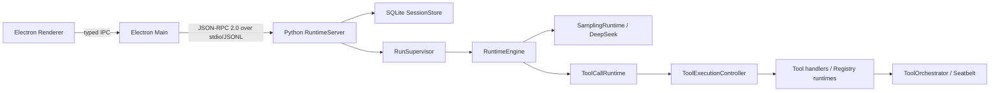

# Eidos 当前架构

本文只描述当前代码。目标态和历史 Phase 文档不构成当前实现依据。

## 进程与控制面

Renderer 只通过 context-isolated preload 暴露的 typed IPC 访问 Main。Main 启动 Python sidecar、校验 JSON-RPC 响应和通知，并负责 Desktop 生命周期。Runtime stdout 只输出协议，日志写 stderr；本地不开放 HTTP、WebSocket 或其他控制端口。

## 状态与恢复权威

- SQLite schema v7 保存 Session、Run、Item、ToolCall、审批、执行段、Step、模型尝试、Durable Intent、事件、Outbox、异步操作和扩展快照。
- SQLite 是唯一业务事实来源。`RunSupervisor` 的 worker/slot、`ResourceRegistry` 和 `RuntimePhaseTracker` 只保存运行中协调或诊断状态。
- `Run.status` 是持久状态权威。`Run.runtimeState` 是可选传输提示；当前 DB mapper 不依赖它恢复执行。
- 业务变更和 Event/Outbox 在同一提交中落库；通知从已提交事件投影。启动恢复不会重放不确定副作用。
- Runtime 只允许一个 Run 占用全局执行 slot；等待审批时可以释放 slot，恢复后重新进入 FIFO。

## Runtime 与 Tool 职责

| 组件 | 当前职责 | 不负责 |
|---|---|---|
| `RuntimeEngine` | 单个 Run 的模型/工具循环协调、预算决策、终止与错误收敛 | 具体工具实现、单 ToolCall 生命周期、沙箱策略 |
| `ToolCallRuntime` | 一个 Step 的 ToolCall 批次校验、创建顺序、并发选择和有序汇总 | Durable Intent/终态提交、权限升级 |
| `ToolExecutionController` | 单个 ToolCall 的 prepare/execute/verify、deadline、取消、Durable Intent、结果校验/投影、终态与 reconciliation | 模型循环、批次调度、Seatbelt 策略 |
| `ToolOrchestrator` | Shell attempt 的有效权限物化、审批要求、Seatbelt/unsandboxed attempt 选择和一次权限升级 | ToolCall DB 生命周期、批次、进程监督实现 |

代码中有两个模块级 `ToolRuntime` Protocol：

- `eidos_runtime.tools.registry.ToolRuntime` 是 Registry 工具的 prepare/execute/verify/invoke 契约。
- `eidos_runtime.runtime.tool_orchestrator.ToolRuntime` 是 `ToolOrchestrator` 接收的沙箱 attempt 契约。

二者没有交叉导入或运行时类型冲突；当前无需重命名。文档和代码引用时应保留模块限定或结合所在模块理解。

## 多 ToolCall 语义

`parallel_tool_calls=true` 只允许模型在一次响应中声明多个 ToolCall，不代表 Runtime 无条件并发。

1. `ToolDispatcher` 先校验整批调用、工具可用性、参数契约、重复 provider ID 和 batch policy；非法组合整批零执行。
2. 只有全部工具同时满足 `batchPolicy=parallel` 与 `concurrency.mode=parallel_safe`，且输入通过敏感信息检查时，批次才并发。
3. 当前符合条件的是内置安全只读工具。Workspace 写入、Shell、Eidos state 和外部/MCP 工具均为 `single`/`exclusive`，不得并发。
4. ToolCall row、`batchOrder`、模型上下文结果和批次汇总始终按模型声明顺序排列，不按线程完成顺序排列。
5. 并发基础设施故障取消同批任务并向上收敛；普通只读工具错误保留为对应 ToolResult，不改变其他结果的声明顺序。

## 关键代码入口

| 边界 | 路径 |
|---|---|
| Desktop shared contract | `desktop/shared/domain-contracts.ts` |
| Main JSON-RPC validator/client | `desktop/main/runtime-client.ts` |
| Python DTO | `runtime/eidos_runtime/protocol/schemas.py` |
| JSON-RPC server | `runtime/eidos_runtime/protocol/server.py` |
| DB schema/mappers/events | `runtime/eidos_runtime/db/` |
| Run loop | `runtime/eidos_runtime/runtime/engine.py` |
| Tool batch/single/orchestration | `runtime/eidos_runtime/runtime/tool_runtime.py`, `tool_execution.py`, `tool_orchestrator.py` |
| Tool contracts/registry | `runtime/eidos_runtime/tools/` |
