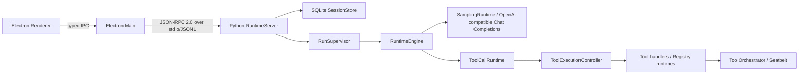

# Eidos 当前架构

本文只描述当前代码。目标态和历史 Phase 文档不构成当前实现依据。

## 进程与控制面



Renderer 只通过 context-isolated preload 暴露的 typed IPC 访问 Main。Main 启动 Python sidecar、校验 JSON-RPC 响应和通知，并负责 Desktop 生命周期。Runtime stdout 只输出协议，日志写 stderr；本地不开放 HTTP、WebSocket 或其他控制端口。

## Runtime Distribution Boundary

Runtime 的业务循环、JSON-RPC 2.0 over stdio 和 `RuntimeClient` 的进程边界在开发与打包模式之间保持一致。Electron Main 在 `desktop/main/runtime-paths.ts` 解析来源：

| 模式 | Python interpreter | Runtime root |
|---|---|---|
| Development | `<appPath>/.venv/bin/python`，可由 `EIDOS_PYTHON` 覆盖 | `<appPath>/runtime` |
| Packaged | `<process.resourcesPath>/runtime/python/bin/python3` | `<process.resourcesPath>/runtime/app` |

Packaged 模式只接受 `process.resourcesPath` 下的 Runtime；缺少 bundled interpreter 或 `app/eidos_runtime` 时直接报告 `bundled runtime unavailable`，不会回退到 PATH、系统 Python 或 `.venv`。`RuntimeClient` 只接收解析后的 `pythonExecutable` 与 `runtimeRoot`，不感知 Electron packaging 状态。

`scripts/build-macos-runtime.sh` 只负责生成 `build/macos-runtime/`：它使用 uv managed CPython 3.12（默认）和 `uv.lock` 的 `--no-dev` production export，复制完整 `runtime/eidos_runtime` package tree，并校验所有 `Path(__file__)` 资源。当前 bundle 只支持 Darwin arm64；它不是 Electron `.app` 或 `.dmg` builder。

Seatbelt 的 commit helper、普通 Shell policy 和 MCP policies 都从当前 Runtime 的 `sys.executable`、`sys.prefix` 与 `sys.base_prefix` 物化 Python root 的只读、metadata、test-existence 和 executable-map 权限；这些 root 不获得写权限。MCP 仍通过真实 Python interpreter 启动 `mcp_launcher.py`，不改变 MCP stdio 协议。

## 状态与恢复权威

- SQLite schema v11 保存 Runtime 事实、Repository generations、retrieval/context snapshots、verified compact summaries 和 checkpoints。全新数据库直接建立完整 v11；v10 数据库在 `BEGIN IMMEDIATE` 内校验并删除旧 `model_profiles`、Capability 与 Run Model Snapshot 表后才更新 `user_version`，失败进入 health-only 且保留原数据。模型配置不写 SQLite。
- SQLite 是唯一业务事实来源。`RunSupervisor` 的 worker/slot、`ResourceRegistry` 和 `RuntimePhaseTracker` 只保存运行中协调或诊断状态。
- `Run.status` 是持久状态权威。`Run.runtimeState` 是可选传输提示；当前 DB mapper 不依赖它恢复执行。
- 业务变更和 Event/Outbox 在同一提交中落库；通知从已提交事件投影。启动恢复不会重放不确定副作用。
- Runtime 只允许一个 Run 占用全局执行 slot；等待审批时可以释放 slot，恢复后重新进入 FIFO。

## Typed foundation and repository intelligence

`domain/` contains strict, frozen records for persisted Run, Item, Step,
ToolCall, Approval and ModelAttempt facts. `persistence/mappers/` is the only
new seam that knows SQLite column names; `TypedRuntimeRepository` returns
validated domain records and never exposes `sqlite3.Row`. Existing write
repositories and `SessionStore` remain compatibility authorities until each
path can migrate without changing transaction semantics.

`protocol/registry.py` owns method lookup and object-shaped request validation.
`RuntimeServer` keeps initialization, shutdown and health as explicit lifecycle
special cases, while the existing public handlers remain compatible. The
small `application/` services (`SessionApplication`, `RunApplication`,
`RepositoryApplication`, `ContextApplication`, `CheckpointApplication` and
`TaskLifecycleApplication`)
are use-case boundaries; they do not own the Runtime loop, Tool lifecycle or
JSON-RPC envelopes.

Repository intelligence is a bounded, immutable snapshot pipeline:

```text
Workspace → Inventory → Tree-sitter Index → Repository Map/Retrieval
                                      ↘ ContextPlan → ContextSnapshot
```

Inventory and index builders reopen and hash regular files, exclude symlinks,
special, ignored and discovery-blocked paths, and retain the last complete
generation when cancellation occurs. `watchfiles` only produces invalidation
signals. Retrieval queries the selected persisted SQLite FTS5 generation plus
typed symbol/import/reference/path relations, RapidFuzz and explicit versioned
signals; each evidence item carries path/hash/generation and ranking reasons.
SQLite progress handlers bound long queries and prevent cross-generation results.

`ProjectRuleResolver` creates immutable, hashed rule snapshots. `ContextPlan`
freezes the selected model profile, rule, inventory, index, map and evidence,
reserves output budget, and produces an immutable per-attempt
`ContextSnapshot`. `ContextCompactionVerifier` validates authoritative source
IDs, workspace changes, approvals and reconciliation facts before a verified
summary and Event/Outbox commit atomically. The loop compactor remains a
compatibility path and does not yet invoke this repository automatically.

主 Agent 的系统指令由 `InstructionResolver` 在每个 Step 构建为严格、冻结的
`ResolvedInstructions`。固定层顺序是 System Safety、Base Agent、Runtime Policy，
随后按项目规则解析顺序加入带相对路径来源的 Project Rule 层，再按 qualified ID
稳定排序加入当前 Turn 实际选中的 Skill 层。优先级语义为 System Safety > Runtime
Policy > Current User Request > Project Rules > Selected Skill Instructions > 历史、
Tool Result、文件内容和元数据；Prompt 文本不改变真实 Sandbox、Approval、Workspace
或 Tool 边界。Skill Catalog、Workspace Environment、历史、ToolCall/ToolResult 和当前
用户请求仍是普通模型上下文，项目规则与 Selected Skill 内容不再在消息中重复。

`ContextBuilder` 是该解析的唯一在线接缝：同一个 `ResolvedInstructions` 同时进入
Context Budget、`StepContext`、模型请求和 Step 最终请求快照。每层内容和最终文本均
使用 UTF-8 SHA-256；`StepResolutionSnapshot.system_prompt_hash` 保留字段名，但校验
已提交 `final_request_json.systemPrompt` 的实际文本，因此后续资源变化不会使历史
Step 失效。Finalization 在相同基础层后临时追加 `finalization-policy` 并继续禁用工具；
stop reason 只作为上下文数据。Title Generation 使用独立的
`TITLE_SYSTEM_INSTRUCTIONS` 与单条当前用户请求，不接收主 Agent 指令、项目规则、
Skill、历史或 Tool Definitions。

模型文字在完整响应返回前保持 provisional，并继续经过 `ModelRunner` 的 Sensitive
Scanner。`ToolCallRuntime` 验证结构化 ToolCall 时，只要响应包含文字，就会先拒绝
provider control syntax；非法文字不会写入 Item，也不会先执行伴随的 ToolCall。验证通过的
`text + tool_calls` 由 `SamplingRuntime.commit_commentary()` 创建、写入并立即完成一个
`assistant_message`，随后才进入 LoopGuard 和 Tool 执行。该中间消息不持有 Run 完成语义，
但作为普通 Assistant Item 参与后续 Context Projection、Compaction 和 Budget。只有
`text + no tool_calls` 进入既有 Final Assistant 路径并与 `Run.status=succeeded` 原子收敛。
Desktop 按 Item ordinal 将最后一个 Tool 之前的 Assistant Item 放入 Process Feed，最后一个
Tool 之后的 Assistant Item 继续作为带反馈与重新回答操作的最终响应；Reasoning 不进入该路径。

在线 `ContextBuilder` 的 Context Usage 以当前 Run 最近一个有 Provider usage 的
`ModelAttempt.usage_json.input_tokens` 作为 Active Context 事实；它不把多个 Attempt
的 input tokens 累加，也不重复加 cache read/write tokens。Provider usage 不可用时才使用
有界的字符估算，并将来源标记为 `estimated`。`ContextUsageSnapshot` 将 Active Context、
模型 Context Window、占用百分比和来源分开保存；`ContextBudget.projected_input_tokens`
则用当前投影估算下一次请求，若有上一请求的 Provider usage 会用该请求的本地估算做
比例校准。因此 Active Context 不会被误当成累计 token，也不会被直接复用成下一请求大小。
`CONTEXT_PROJECTION_MAX_BYTES` 与 `CONTEXT_PROJECTION_MAX_ITEMS` 是未受保护历史的软投影
上限，不代表模型窗口；最近事实可在独立的 8 MiB/2000-item 硬序列化上限内继续保留。
候选投影溢出是独立的 projection fact：Runtime 会压缩受保护边界之外的最旧可压缩历史，
直到 `source_item_ids` 覆盖所有被省略的事实；没有持久覆盖进展时以
`CONTEXT_PROJECTION_OVERFLOW` 失败，不伪装成 Provider Context Limit。Compaction count
只作持久 telemetry。Provider 明确返回 `context_exceeded` 时，Runtime 会先执行一次
有进展的 compaction、重新投影并重试，重复同一 Context 状态或无进展时以
`context_still_over_budget` 收敛。

Desktop 的 Context Usage 通过 `context/usage` JSON-RPC 方法按 Run 读取：Runtime 先读取
持久化的最近 Provider `ModelAttempt.usage_json.input_tokens`，无 Provider usage 时回退到
最近精确 `ContextSnapshot` 中已标记为 `estimated` 的预算；Main 只做 DTO 校验和字段映射，
Renderer 只负责紧凑格式化与状态刷新。该值不是新的 SQLite 事实表，也不把累计请求 Token
投影到 Composer。

Desktop 的 Context Usage 通过 `context/usage` JSON-RPC 方法按 Run 读取：Runtime 先读取
持久化的最近 Provider `ModelAttempt.usage_json.input_tokens`，无 Provider usage 时回退到
最近精确 `ContextSnapshot` 中已标记为 `estimated` 的预算；Main 只做 DTO 校验和字段映射，
Renderer 只负责紧凑格式化与状态刷新。该值不是新的 SQLite 事实表，也不把累计请求 Token
投影到 Composer。

Desktop 的 Context Usage 通过 `context/usage` JSON-RPC 方法按 Run 读取：Runtime 先读取
持久化的最近 Provider `ModelAttempt.usage_json.input_tokens`，无 Provider usage 时回退到
最近精确 `ContextSnapshot` 中已标记为 `estimated` 的预算；Main 只做 DTO 校验和字段映射，
Renderer 只负责紧凑格式化与状态刷新。该值不是新的 SQLite 事实表，也不把累计请求 Token
投影到 Composer。

`ContextCompactor` 使用 deterministic structured extraction 生成并持久化摘要：任务目标与
用户约束、workspace version/reconciliation state、Tool Result 中的路径/hash/symbol/匹配、
成功事实、实际修改、失败尝试、未解决问题、决定和下一步分别保留；完整历史 Item 仍是
SQLite source of truth。摘要 metadata 与主摘要在同一 SQLite 事务提交，重启后不丢失可恢复
的 optional fields。项目规则不复制进摘要，而由每次 `ContextBuilder` 构建重新注入。

Long-task progress is stored as typed JSON in the existing `operations` table
under `long_task/control`, with compare-and-set updates. Pause is reported only at
explicit safe points; resume checks Workspace identity, Git HEAD, rules, index,
Context Plan, permission snapshot and uncertain side effects. The repository
and verifier are consumed by `RunSupervisor` and `RuntimeEngine` through typed
`run/status`, `run/pause`, `run/resume` and `run/cancel` boundaries. Startup
persists an idempotent verification result before scheduling. Checkpoint RPCs
freeze rule/repository/context/compaction/model/permission lineage; full rewind
context reconstruction remains a documented limitation.

## Runtime 与 Tool 职责

| 组件 | 当前职责 | 不负责 |
|---|---|---|
| `RuntimeEngine` | 单个 Run 的模型/工具循环协调、Context 决策、终止与错误收敛 | 具体工具实现、单 ToolCall 生命周期、沙箱策略 |
| `ToolCallRuntime` | 一个 Step 的 ToolCall 批次校验、创建顺序、并发选择和有序汇总 | Durable Intent/终态提交、权限升级 |
| `ToolExecutionController` | 单个 ToolCall 的 prepare/execute/verify、deadline、取消、Durable Intent、结果校验/投影、终态与 reconciliation | 模型循环、批次调度、Seatbelt 策略 |
| `ToolOrchestrator` | Shell attempt 的有效权限物化、审批要求、Seatbelt/unsandboxed attempt 选择和一次权限升级 | ToolCall DB 生命周期、批次、进程监督实现 |

Workspace discovery is a separate presentation boundary. `list_files` and
`search_text` load root `.gitignore` followed by root `.eidosignore` through
the Workspace descriptor and use PathSpec only to filter ordinary discovery
results. The later `.eidosignore` rules may refine ordinary Git-ignore
matches; Eidos-owned hard discovery directories remain non-overridable.
`list_files` accepts a workspace-relative `path`, bounded `maxDepth` and
`maxEntries`; `search_text` accepts a workspace-relative `path`, bounded
`maxResults`, optional `regex`, and optional positive `includeGlobs`. The
default empty argument objects retain root-scope literal discovery. Every
returned path remains Workspace-relative and the input contract rejects
absolute or parent-traversing scopes.
Ignore rules are not permissions: explicit file operations retain their
existing Workspace and sensitive-content checks. Shell launch validates the
Workspace root identity, workspace-relative cwd, approval and Seatbelt
boundary without requiring a complete repository-wide content scan or a shell
command allowlist/parser. The WorkspaceIndex refresh remains an independent
post-execution reconciliation and evidence traversal; if the before manifest
was incomplete, or the after scan is incomplete, the canonical result does not
claim the visible entries were created and reports an unknown Workspace change
state. A known successful exit remains completed unless the Shell execution or
Runtime layer explicitly reports uncertainty; incomplete Workspace observation
alone does not require reconciliation. Seatbelt, fd-relative Workspace checks,
explicit file-operation validation and output scanning remain authoritative
security boundaries.

`search_text` delegates text matching to the synchronous
`RipgrepSearchDriver`. The production resolver accepts only the pinned
Ripgrep 15.2.0 macOS arm64 resource at
`runtime/eidos_runtime/resources/bin/ripgrep/darwin-arm64/rg`, verifies its
manifest identity, owner, mode and SHA256, and never searches `PATH` or
downloads a binary. The driver launches a fixed argv with `shell=False`, a
minimal environment, `--no-config`, caller-selected literal or regex matching,
and ASCII-only case folding. Ripgrep ignore sources are disabled so nested/global/user ignore
files cannot change C2 semantics; the already-loaded `WorkspaceDiscoveryScope`
and shared Eidos discovery policy filter every returned path. Hard and
sensitive directories are also excluded in argv as defense in depth, but argv
globs and ignore rules are not treated as security authorization.

Context projection separately deduplicates identical complete results from
read-only discovery tools when their canonical arguments, result and observed
Workspace state are unchanged. It leaves the first result authoritative,
replaces later copies with a small `duplicateOf` marker, and resets the
deduplication state after a reported Workspace change; this is independent of
LoopGuard convergence. LoopGuard fingerprints the exact Tool batch together
with Workspace version, reconciliation epoch, active errors and a canonical
durable-context frontier that excludes timestamps, Step indexes and call IDs.
After a Tool result is committed, the first return to the same semantic state
skips duplicate execution and injects one generic recovery fact. Only returning
to that same fingerprint after recovery gracefully stops the Run. New verified
evidence, user input, Workspace/diff change, resolved errors or reconciliation
change advances the frontier and keeps the Run alive.

`apply_patch` delegates Unified Diff structure and metadata parsing to
`unidiff`. Eidos accepts only one existing-file modification whose headers
match the authoritative Tool path, rejects Git extensions and unsupported EOF
markers, verifies every context/removal line exactly, and constructs the full
candidate before the existing approval, version recheck, atomic commit and
recovery lifecycle.

Ripgrep stdout, stderr, JSON line size, event count, preview, file size and
result count are bounded. Deadline, cancellation and the 100-result limit
terminate and reap the dedicated process group. `scannedBytes` is the sum of
Ripgrep `end.stats.bytes_searched` for accepted files that produced a match,
falling back to the stable validated file size only when the result limit ends
the process before its `end` event; ignored and sensitive paths do not enter
the metric. Missing, invalid or malformed backends fail explicitly and never
fall back to the former Python traversal.

代码中有两个模块级 `ToolRuntime` Protocol：

- `eidos_runtime.tools.registry.ToolRuntime` 是 Registry 工具的 prepare/execute/verify/invoke 契约。
- `eidos_runtime.runtime.tool_orchestrator.ToolRuntime` 是 `ToolOrchestrator` 接收的沙箱 attempt 契约。

二者没有交叉导入或运行时类型冲突；当前无需重命名。文档和代码引用时应保留模块限定或结合所在模块理解。

动态 MCP/外部 Tool Schema 由 `jsonschema` 的 Draft 2020-12 校验器执行标准 `type`、枚举、边界和闭合对象规则；Eidos 的 `BoundedJsonSchema` 仍在构造前 fail-closed 地限制 Schema/Value 字节、深度和节点数、允许关键字与类型、JSON 安全数值和稳定错误码。它不支持 `$ref` 或其他引用关键字，并使用没有检索器的 `referencing.Registry`，因此 Schema 不能触发网络、文件或包资源访问。默认值是 Eidos 独立的确定性投影：只写入显式属性默认值，且不创建缺失父对象；它先校验原始输入边界、复制并应用 defaults，再以 JSON-safe integer enforcement 重检扩展候选值，最后进行标准 Schema 校验。因此 default expansion 不能绕过 Eidos 的 bytes、depth、node、finite-number 或 object-key 边界。

## 多 ToolCall 语义

`parallel_tool_calls=true` 只允许模型在一次响应中声明多个 ToolCall，不代表 Runtime 无条件并发。

1. `ToolDispatcher` 先校验整批调用、工具可用性、参数契约、重复 provider ID 和 batch policy；非法组合整批零执行。
2. 只有全部工具同时满足 `batchPolicy=parallel` 与 `concurrency.mode=parallel_safe`，且输入通过敏感信息检查时，批次才并发。
3. 当前符合条件的是内置安全只读工具。Workspace 写入、Shell、Eidos state 和外部/MCP 工具均为 `single`/`exclusive`，不得并发。
4. ToolCall row、`batchOrder`、模型上下文结果和批次汇总始终按模型声明顺序排列，不按线程完成顺序排列。
5. 并发基础设施故障取消同批任务并向上收敛；普通只读工具错误保留为对应 ToolResult，不改变其他结果的声明顺序。

## 关键代码入口

| 边界 | 路径 |
|---|---|
| Desktop shared contract | `desktop/shared/domain-contracts.ts` |
| Local model catalog/store | `runtime/eidos_runtime/model/config.py` → `~/.eidos/models.json` |
| Main JSON-RPC validator/client | `desktop/main/runtime-client.ts` |
| Python DTO | `runtime/eidos_runtime/protocol/schemas.py` |
| JSON-RPC server | `runtime/eidos_runtime/protocol/server.py` |

本地模型目录只包含 DeepSeek、MiniMax 和 Kimi 的五个固定模型；模型 ID、Chat Completions URL 与能力标记由 Runtime 填充，API Key 直接保存在用户私有的 `~/.eidos/models.json`。`model/list` 是 Desktop 选择器的唯一数据源，`run/start` 只传 `modelId`；每个 Run 在创建时冻结实际配置，因此同一 Session 可以在 Turn 之间切换，活动 Run 不受后续编辑或删除影响。不存在 Test Connection、Capability Probe、Capability Snapshot、密钥引用或 SQLite Model Profile 权威。三个 Provider 都由 Pydantic AI 的 `OpenAIChatModel` 进入同一 Chat Completions 流式与 ToolCall 路径。

注入的 HTTP Client 由 Pydantic AI `AsyncTenacityTransport` 执行建立响应流前的唯一网络重试，OpenAI SDK `max_retries=0`；Transport Retry 不增加 SQLite `model_attempt`，流已消费后不重放。

Runtime Core 目前仍是同步 Durable Runtime，`RunSupervisor` 与 Run Worker 仍使用线程。模型异步 I/O 由 `RuntimeServer` 唯一持有的 `RuntimeAsyncKernel` 承载：一个进程级 AnyIO `BlockingPortal` 可并发执行多个 Model Client、Run Sampling 与标题生成请求；Client 只通过该 kernel 调用 Pydantic AI 的公开异步 Direct API。Kernel 还通过 `RuntimeAsyncTask` 拥有通用异步 Task/Service 的启动、取消、等待、结果和有界诊断；Service readiness 使用 AnyIO `task_status.started(value)`，Portal 不暴露给业务模块。每个 owned task 对应一个 `async_task` 资源，完成后从活跃集合移除；Kernel shutdown 先拒绝新任务、协作取消并有界等待，未真实退出时保留资源并报告 `ASYNC_KERNEL_TASK_SHUTDOWN_TIMEOUT`。

MCP Connection 通过 initialize 阶段一次性绑定的同一 Kernel 启动为长生命周期 Service；一个私有的 AnyIO startup timeout 覆盖 private HOME/TMP、环境与 sandbox argv 准备、`stdio_client`/子进程、官方 `ClientSession`、初始化和分页 Tool Discovery，直到 `task_status.started()`。成功 ready 后该 timeout 被禁用，Service/`ASYNC_TASK` 的 `deadline` 为 `None`，不会把已过期的启动时间显示为活跃诊断。同步 Tool Adapter 通过 Kernel 受控边界调用私有 Session，同一 Session 使用 AnyIO Lock 串行化 Tool Call/Refresh；Connection 不再拥有 `Thread`、`queue.Queue`、轮询完成 Event 或独立 `anyio.run()`。Tool List Changed 的同步 SQLite bookkeeping 通过不 abandon 的 AnyIO worker bridge 执行；关闭会等待已经开始的 callback，callback 本身失败只记录安全日志，不把健康的 MCP session 映射为协议失败。基础设施取消保持为 AnyIO cancellation 而非 `McpUnavailable`。`MCP_CONNECTION` 与 `MCP_COMMAND` 仍表达领域资源，Kernel 的 `ASYNC_TASK` 只表达基础设施 ownership；startup timeout、transport/protocol failure、sandbox unavailable 分别稳定映射为 `mcp_startup_timeout`、`mcp_protocol_error`、`mcp_sandbox_unavailable`；超时/取消后的副作用不确定性、Launcher/PID/进程组、Seatbelt、私有 HOME/TMP 和 stdout 污染 fail-closed 语义保持不变。

Title Generation 与 Plugin Import 等 Managed Task 同样由 `RuntimeAsyncTask` Handle 拥有；保留的同步 `Callable[[threading.Event], None]` 通过 `anyio.to_thread.run_sync()` 执行，未启用 abandon-on-cancel。Shutdown 先设置 Eidos cooperative cancellation Event，再有界等待同步函数真实退出；未退出时保留 `MANAGED_TASK`、`ASYNC_REQUEST` 与 `ASYNC_TASK` 事实并报告 timeout，不把 worker Future 取消误判为底层工作停止。

只读并行 Batch 的同步入口通过同一 Kernel 进入 AnyIO TaskGroup，每个现有同步 read execution 使用默认等待真实退出的 AnyIO worker thread bridge；不再为每个 Batch 创建 `ThreadPoolExecutor` 或依赖 Future 完成顺序。`ToolConcurrencyGate` 继续权威表达 max concurrency、exclusive mode、resource/exclusive key 和 cancellation policy；只有 Dispatcher 确认为只读且所有参数通过 Sensitive Scanner 的完整 Batch 才进入该路径。基础设施失败或取消会设置共享 cooperative signal，并等待所有已启动执行终止；Infrastructure Error 优先，普通 Tool Error 不取消合法 sibling，最终 Outcome、Item、Event、Context Fact 和 progress fingerprint 仍按原 Batch Order 汇总。关闭顺序仍先结束 Run-scoped MCP、Managed Task、Tool Execution、Run/Model Client，再关闭 kernel 并释放唯一 `async_kernel` 资源。

Shutdown quiescence 只由显式 Run Handle、Model Lease、Kernel Task Handle、`ResourceRegistry`、持久 Run 状态和 MCP child process ownership 判定，不扫描全局线程名，也不维护第二份 Tool 活跃计数。Timeout 日志最多列出 100 个结构化诊断，只包含 `kind`、`owner_id`、`state`、`deadline` 与 `diagnostic_code`。

### Eidos 1.0 sync/async boundary

Eidos 1.0 不追求零线程架构。Durable Runtime core 保持同步：`RuntimeEngine`、`RunSupervisor` FIFO/执行 slot、SQLite 事务和状态迁移、Approval 持久状态机、Context 构建与压缩、Tool 副作用编排、Sandbox/进程核验，以及 Recovery/Reconciliation 都继续由同步核心拥有。每个活跃 Run 一个 Worker Thread 是刻意的隔离边界，不是待消除的过渡实现。

进程唯一的 `RuntimeAsyncKernel` 集中拥有 Pydantic AI 网络 I/O、MCP connection service、Managed Task 调度、并行只读协调和 provider client 的异步 close。同步 Worker、AnyIO worker 或其他非 Portal 调用者可以同步进入 Kernel；Kernel Event Loop Thread 不得同步重入 `RuntimeAsyncKernel.call()`，会以 `ASYNC_KERNEL_REENTRY` 立即失败。模型流的 blocking callback 通过串行 AnyIO worker bridge 执行，因此不会在 Kernel Event Loop 上执行 SQLite 或 Event publication；SQLite 仍是同步且唯一的业务事实来源。

原生 async `RuntimeEngine`/`RunSupervisor` 转换延后，直到以下任一条件成立：测得 Run-thread scalability 已成为瓶颈、并行 Agent 数量超过有界线程模型、SQLite 被替换为 async persistence boundary，或 profiling 证明 Event Loop/线程竞争有显著影响。在此之前不维护 `AsyncModelClient`、async `ApprovalCoordinator`、双 sync/async Sampling/ToolCall Runtime、`RuntimeEngine.arun()` 或 async `RunSupervisor` 的占位接口。
| DB schema/mappers/events | `runtime/eidos_runtime/db/` |
| Run loop | `runtime/eidos_runtime/runtime/engine.py` |
| Tool batch/single/orchestration | `runtime/eidos_runtime/runtime/tool_runtime.py`, `tool_execution.py`, `tool_orchestrator.py` |
| Tool contracts/registry | `runtime/eidos_runtime/tools/` |
