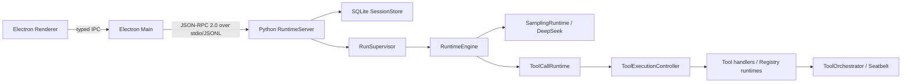

# Eidos 当前架构

本文只描述当前代码。目标态和历史 Phase 文档不构成当前实现依据。

## 进程与控制面

Renderer 只通过 context-isolated preload 暴露的 typed IPC 访问 Main。Main 启动 Python sidecar、校验 JSON-RPC 响应和通知，并负责 Desktop 生命周期。Runtime stdout 只输出协议，日志写 stderr；本地不开放 HTTP、WebSocket 或其他控制端口。

## 状态与恢复权威

- SQLite schema v7 保存 Session、Run、Item、ToolCall、审批、执行段、Step、模型尝试、Durable Intent、事件、Outbox、异步操作和扩展快照。
- SQLite 是唯一业务事实来源。`RunSupervisor` 的 worker/slot、`ResourceRegistry` 和 `RuntimePhaseTracker` 只保存运行中协调或诊断状态。
- `Run.status` 是持久状态权威。`Run.runtimeState` 是可选传输提示；当前 DB mapper 不依赖它恢复执行。
- 业务变更和 Event/Outbox 在同一提交中落库；通知从已提交事件投影。启动恢复不会重放不确定副作用。
- Runtime 只允许一个 Run 占用全局执行 slot；等待审批时可以释放 slot，恢复后重新进入 FIFO。

## Runtime 与 Tool 职责

| 组件 | 当前职责 | 不负责 |
|---|---|---|
| `RuntimeEngine` | 单个 Run 的模型/工具循环协调、预算决策、终止与错误收敛 | 具体工具实现、单 ToolCall 生命周期、沙箱策略 |
| `ToolCallRuntime` | 一个 Step 的 ToolCall 批次校验、创建顺序、并发选择和有序汇总 | Durable Intent/终态提交、权限升级 |
| `ToolExecutionController` | 单个 ToolCall 的 prepare/execute/verify、deadline、取消、Durable Intent、结果校验/投影、终态与 reconciliation | 模型循环、批次调度、Seatbelt 策略 |
| `ToolOrchestrator` | Shell attempt 的有效权限物化、审批要求、Seatbelt/unsandboxed attempt 选择和一次权限升级 | ToolCall DB 生命周期、批次、进程监督实现 |

Workspace discovery is a separate presentation boundary. `list_files` and
`search_text` load root `.gitignore` followed by root `.eidosignore` through
the Workspace descriptor and use PathSpec only to filter ordinary discovery
results. The later `.eidosignore` rules may refine ordinary Git-ignore
matches; Eidos-owned hard discovery directories remain non-overridable.
Ignore rules are not permissions: explicit file operations retain their
existing Workspace and sensitive-content checks, while WorkspaceIndex shell
preflight and side-effect manifests continue their independent security and
evidence traversals.

`search_text` delegates text matching to the synchronous
`RipgrepSearchDriver`. The production resolver accepts only the pinned
Ripgrep 15.2.0 macOS arm64 resource at
`runtime/eidos_runtime/resources/bin/ripgrep/darwin-arm64/rg`, verifies its
manifest identity, owner, mode and SHA256, and never searches `PATH` or
downloads a binary. The driver launches a fixed argv with `shell=False`, a
minimal environment, `--no-config`, fixed-string matching and ASCII-only
case folding. Ripgrep ignore sources are disabled so nested/global/user ignore
files cannot change C2 semantics; the already-loaded `WorkspaceDiscoveryScope`
and shared Eidos discovery policy filter every returned path. Hard and
sensitive directories are also excluded in argv as defense in depth, but argv
globs and ignore rules are not treated as security authorization.

`apply_patch` delegates Unified Diff structure and metadata parsing to
`unidiff`. Eidos accepts only one existing-file modification whose headers
match the authoritative Tool path, rejects Git extensions and unsupported EOF
markers, verifies every context/removal line exactly, and constructs the full
candidate before the existing approval, version recheck, atomic commit and
recovery lifecycle.

Ripgrep stdout, stderr, JSON line size, event count, preview, file size and
result count are bounded. Deadline, cancellation and the 100-result limit
terminate and reap the dedicated process group. `scannedBytes` is the sum of
Ripgrep `end.stats.bytes_searched` for accepted files that produced a match,
falling back to the stable validated file size only when the result limit ends
the process before its `end` event; ignored and sensitive paths do not enter
the metric. Missing, invalid or malformed backends fail explicitly and never
fall back to the former Python traversal.

代码中有两个模块级 `ToolRuntime` Protocol：

- `eidos_runtime.tools.registry.ToolRuntime` 是 Registry 工具的 prepare/execute/verify/invoke 契约。
- `eidos_runtime.runtime.tool_orchestrator.ToolRuntime` 是 `ToolOrchestrator` 接收的沙箱 attempt 契约。

二者没有交叉导入或运行时类型冲突；当前无需重命名。文档和代码引用时应保留模块限定或结合所在模块理解。

动态 MCP/外部 Tool Schema 由 `jsonschema` 的 Draft 2020-12 校验器执行标准 `type`、枚举、边界和闭合对象规则；Eidos 的 `BoundedJsonSchema` 仍在构造前 fail-closed 地限制 Schema/Value 字节、深度和节点数、允许关键字与类型、JSON 安全数值和稳定错误码。它不支持 `$ref` 或其他引用关键字，并使用没有检索器的 `referencing.Registry`，因此 Schema 不能触发网络、文件或包资源访问。默认值是 Eidos 独立的确定性投影：只写入显式属性默认值，且不创建缺失父对象；它先校验原始输入边界、复制并应用 defaults，再以 JSON-safe integer enforcement 重检扩展候选值，最后进行标准 Schema 校验。因此 default expansion 不能绕过 Eidos 的 bytes、depth、node、finite-number 或 object-key 边界。

## 多 ToolCall 语义

`parallel_tool_calls=true` 只允许模型在一次响应中声明多个 ToolCall，不代表 Runtime 无条件并发。

1. `ToolDispatcher` 先校验整批调用、工具可用性、参数契约、重复 provider ID 和 batch policy；非法组合整批零执行。
2. 只有全部工具同时满足 `batchPolicy=parallel` 与 `concurrency.mode=parallel_safe`，且输入通过敏感信息检查时，批次才并发。
3. 当前符合条件的是内置安全只读工具。Workspace 写入、Shell、Eidos state 和外部/MCP 工具均为 `single`/`exclusive`，不得并发。
4. ToolCall row、`batchOrder`、模型上下文结果和批次汇总始终按模型声明顺序排列，不按线程完成顺序排列。
5. 并发基础设施故障取消同批任务并向上收敛；普通只读工具错误保留为对应 ToolResult，不改变其他结果的声明顺序。

## 关键代码入口

| 边界 | 路径 |
|---|---|
| Desktop shared contract | `desktop/shared/domain-contracts.ts` |
| Model Profile generated contract | `runtime/eidos_runtime/contracts/export_model_profile.py` → `contracts/generated/model-profile.schema.json` → `desktop/shared/generated/runtime/model-profile.ts` |
| Main JSON-RPC validator/client | `desktop/main/runtime-client.ts` |
| Python DTO | `runtime/eidos_runtime/protocol/schemas.py` |
| JSON-RPC server | `runtime/eidos_runtime/protocol/server.py` |

Model Profile 能力只由本地声明解析：显式用户声明优先于内置 Provider Preset，Preset 缺失时保守为不支持。Eidos 不发送 Test Connection 或能力探测请求；网络、认证和 Provider 兼容性仅由真实 Model Attempt 的稳定错误映射确认。新 Run 冻结当时解析出的能力，历史持久化 Snapshot 仅用于读取兼容，不决定 Profile 是否可选。Model Gateway 直接用冻结 Profile 构造 Pydantic AI Provider 和 Model，`WireAPI` 选择对应模型类；Eidos 不维护独立的 Provider/Wire transport registry。注入的 HTTP Client 由 Pydantic AI `AsyncTenacityTransport` 执行建立响应流前的唯一网络重试，OpenAI SDK `max_retries=0`；`RetryPolicy.max_attempts` 是单个逻辑 Model Attempt 内的总 HTTP 请求数，Transport Retry 不增加 SQLite `model_attempt`，流已消费后不重放。

Runtime Core 目前仍是同步 Durable Runtime，`RunSupervisor` 与 Run Worker 仍使用线程。模型异步 I/O 由 `RuntimeServer` 唯一持有的 `RuntimeAsyncKernel` 承载：一个进程级 AnyIO `BlockingPortal` 可并发执行多个 Model Client、Run Sampling 与标题生成请求；Client 只通过该 kernel 调用 Pydantic AI 的公开异步 Direct API。Kernel 还通过 `RuntimeAsyncTask` 拥有通用异步 Task/Service 的启动、取消、等待、结果和有界诊断；Service readiness 使用 AnyIO `task_status.started(value)`，Portal 不暴露给业务模块。每个 owned task 对应一个 `async_task` 资源，完成后从活跃集合移除；Kernel shutdown 先拒绝新任务、协作取消并有界等待，未真实退出时保留资源并报告 `ASYNC_KERNEL_TASK_SHUTDOWN_TIMEOUT`。

MCP Connection 通过 initialize 阶段一次性绑定的同一 Kernel 启动为长生命周期 Service；一个私有的 AnyIO startup timeout 覆盖 private HOME/TMP、环境与 sandbox argv 准备、`stdio_client`/子进程、官方 `ClientSession`、初始化和分页 Tool Discovery，直到 `task_status.started()`。成功 ready 后该 timeout 被禁用，Service/`ASYNC_TASK` 的 `deadline` 为 `None`，不会把已过期的启动时间显示为活跃诊断。同步 Tool Adapter 通过 Kernel 受控边界调用私有 Session，同一 Session 使用 AnyIO Lock 串行化 Tool Call/Refresh；Connection 不再拥有 `Thread`、`queue.Queue`、轮询完成 Event 或独立 `anyio.run()`。Tool List Changed 的同步 SQLite bookkeeping 通过不 abandon 的 AnyIO worker bridge 执行；关闭会等待已经开始的 callback，callback 本身失败只记录安全日志，不把健康的 MCP session 映射为协议失败。基础设施取消保持为 AnyIO cancellation 而非 `McpUnavailable`。`MCP_CONNECTION` 与 `MCP_COMMAND` 仍表达领域资源，Kernel 的 `ASYNC_TASK` 只表达基础设施 ownership；startup timeout、transport/protocol failure、sandbox unavailable 分别稳定映射为 `mcp_startup_timeout`、`mcp_protocol_error`、`mcp_sandbox_unavailable`；超时/取消后的副作用不确定性、Launcher/PID/进程组、Seatbelt、私有 HOME/TMP 和 stdout 污染 fail-closed 语义保持不变。

Title Generation 与 Plugin Import 等 Managed Task 同样由 `RuntimeAsyncTask` Handle 拥有；保留的同步 `Callable[[threading.Event], None]` 通过 `anyio.to_thread.run_sync()` 执行，未启用 abandon-on-cancel。Shutdown 先设置 Eidos cooperative cancellation Event，再有界等待同步函数真实退出；未退出时保留 `MANAGED_TASK`、`ASYNC_REQUEST` 与 `ASYNC_TASK` 事实并报告 timeout，不把 worker Future 取消误判为底层工作停止。

只读并行 Batch 的同步入口通过同一 Kernel 进入 AnyIO TaskGroup，每个现有同步 read execution 使用默认等待真实退出的 AnyIO worker thread bridge；不再为每个 Batch 创建 `ThreadPoolExecutor` 或依赖 Future 完成顺序。`ToolConcurrencyGate` 继续权威表达 max concurrency、exclusive mode、resource/exclusive key 和 cancellation policy；只有 Dispatcher 确认为只读且所有参数通过 Sensitive Scanner 的完整 Batch 才进入该路径。基础设施失败或取消会设置共享 cooperative signal，并等待所有已启动执行终止；Infrastructure Error 优先，普通 Tool Error 不取消合法 sibling，最终 Outcome、Item、Event、Context Fact 和 progress fingerprint 仍按原 Batch Order 汇总。关闭顺序仍先结束 Run-scoped MCP、Managed Task、Tool Execution、Run/Model Client，再关闭 kernel 并释放唯一 `async_kernel` 资源。

Shutdown quiescence 只由显式 Run Handle、Model Lease、Kernel Task Handle、`ResourceRegistry`、持久 Run 状态和 MCP child process ownership 判定，不扫描全局线程名，也不维护第二份 Tool 活跃计数。Timeout 日志最多列出 100 个结构化诊断，只包含 `kind`、`owner_id`、`state`、`deadline` 与 `diagnostic_code`。

### Eidos 1.0 sync/async boundary

Eidos 1.0 不追求零线程架构。Durable Runtime core 保持同步：`RuntimeEngine`、`RunSupervisor` FIFO/执行 slot、SQLite 事务和状态迁移、Approval 持久状态机、Context 构建与压缩、Tool 副作用编排、Sandbox/进程核验，以及 Recovery/Reconciliation 都继续由同步核心拥有。每个活跃 Run 一个 Worker Thread 是刻意的隔离边界，不是待消除的过渡实现。

进程唯一的 `RuntimeAsyncKernel` 集中拥有 Pydantic AI 网络 I/O、MCP connection service、Managed Task 调度、并行只读协调和 provider client 的异步 close。同步 Worker、AnyIO worker 或其他非 Portal 调用者可以同步进入 Kernel；Kernel Event Loop Thread 不得同步重入 `RuntimeAsyncKernel.call()`，会以 `ASYNC_KERNEL_REENTRY` 立即失败。模型流的 blocking callback 通过串行 AnyIO worker bridge 执行，因此不会在 Kernel Event Loop 上执行 SQLite 或 Event publication；SQLite 仍是同步且唯一的业务事实来源。

原生 async `RuntimeEngine`/`RunSupervisor` 转换延后，直到以下任一条件成立：测得 Run-thread scalability 已成为瓶颈、并行 Agent 数量超过有界线程模型、SQLite 被替换为 async persistence boundary，或 profiling 证明 Event Loop/线程竞争有显著影响。在此之前不维护 `AsyncModelClient`、async `ApprovalCoordinator`、双 sync/async Sampling/ToolCall Runtime、`RuntimeEngine.arun()` 或 async `RunSupervisor` 的占位接口。
| DB schema/mappers/events | `runtime/eidos_runtime/db/` |
| Run loop | `runtime/eidos_runtime/runtime/engine.py` |
| Tool batch/single/orchestration | `runtime/eidos_runtime/runtime/tool_runtime.py`, `tool_execution.py`, `tool_orchestrator.py` |
| Tool contracts/registry | `runtime/eidos_runtime/tools/` |
