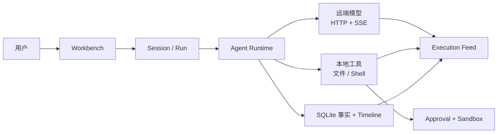
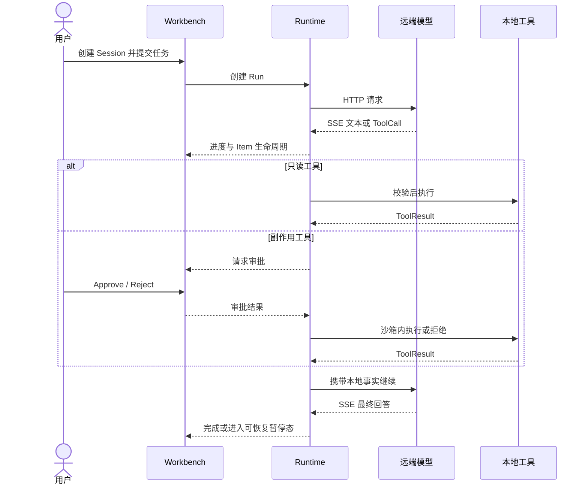

# Eidos Agent Runtime 目标态 PRD

版本：v0.4（探索草案）

本 PRD 描述产品方向和目标态约束，不代表当前代码已经实现。当前能力与限制以 [当前能力](../current-capabilities.md)、[当前限制](../current-limitations.md)、代码和测试为准；旧阶段记录已归档到 [`archive/phases/`](../archive/phases/README.md)。

## 1. 产品总览

Eidos 是仅面向 macOS 的本地、前台、审批驱动的个人 Agent Runtime。用户提交任务后，Runtime 在可观察、可取消、可恢复核验的执行链中调用模型和受控工具；所有副作用均受本地授权与沙箱约束。



产品不把“模型能提出操作”视为“模型有权执行操作”。Runtime 的本地契约、当前状态、用户审批和沙箱共同决定操作是否能执行。

## 2. 核心用户旅程



## 3. 产品模块与关系

| 模块 | 用户价值 | 上游/下游关系 | PRD 细节 | TDD 落点 |
|---|---|---|---|---|
| Workbench | 创建任务、查看执行、处理审批与恢复 | 只消费 Runtime 的闭合状态与事件 | [用户流程与界面](02-user-flows-and-ui.md) | [Desktop](../tdd/06-desktop-security-lifecycle.md)、[协议/Event](../tdd/05-api-events-storage.md) |
| Session / Run | 组织上下文、任务、队列与生命周期 | Session 固化工作空间和模型；Run 驱动执行 | [产品定位与范围](01-product-scope.md)、[功能需求](03-functional-requirements.md) | [Runtime 状态机](../tdd/02-runtime-state-machine.md)、[协议/存储](../tdd/05-api-events-storage.md) |
| Agent Execution | 模型、工具、结果和继续推理的串行闭环 | 读取 Context，产出 Item/ToolCall/Event | [功能需求](03-functional-requirements.md) | [Runtime 状态机](../tdd/02-runtime-state-machine.md)、[模型](../tdd/04-model-context-streaming.md)、[工具](../tdd/03-tools-approval-sandbox.md) |
| Model & Context | 管理远端模型配置、HTTP/SSE 流和有界上下文 | Provider 事件先进入 Runtime，不直达 UI | [功能需求](03-functional-requirements.md)、[安全与非功能需求](04-security-and-nfr.md) | [模型、上下文与流](../tdd/04-model-context-streaming.md) |
| Tools / Approval / Sandbox | 安全地读取、修改文件和执行命令 | ToolSpec 决定能力；Approval 不突破 Sandbox | [功能需求](03-functional-requirements.md)、[安全与非功能需求](04-security-and-nfr.md) | [工具、审批与沙箱](../tdd/03-tools-approval-sandbox.md) |
| Extensions | 从本地 Plugin 安全加载 Skill 与 MCP Tool | Catalog 产出快照；Registry 统一执行；外部工具仍经过审批/沙箱 | [产品定位与范围](01-product-scope.md)、[功能需求](03-functional-requirements.md) | [架构](../tdd/01-architecture.md)、[工具](../tdd/03-tools-approval-sandbox.md)、[协议/存储](../tdd/05-api-events-storage.md) |
| Timeline & Recovery | 让重载、重启和失败后的事实保持一致 | 规范化状态是当前事实，Event 是有序投影 | [安全与非功能需求](04-security-and-nfr.md) | [协议、事件与存储](../tdd/05-api-events-storage.md)、[状态机](../tdd/02-runtime-state-machine.md) |
| Artifact / Public Mode | 将内部结果发布为可见、不可变产物 | 依赖工具、安全扫描和持久化 | [产品定位与范围](01-product-scope.md)、[用户流程与界面](02-user-flows-and-ui.md) | [工具](../tdd/03-tools-approval-sandbox.md)、[存储](../tdd/05-api-events-storage.md) |
| Verification | 把产品承诺转成可执行验收条件 | 每个进入阶段的要求最终落到 A 编号 | [验收标准](05-acceptance-criteria.md) | [测试与里程碑](../tdd/07-testing-and-milestones.md) |

## 4. 文档结构

```text
01 产品定位与范围      为什么做、为谁做、做什么、不做什么
02 用户流程与界面      用户从入口到终态如何操作和理解状态
03 功能需求            按 F 编号定义模块能力和行为合同
04 安全与非功能需求    跨模块安全、可靠性、容量和恢复不变量
05 验收标准            按 A 编号把需求变成可验证结果
```

阅读单个模块时，按“用户流程 → F 功能编号 → 安全/NFR → A 验收编号”追踪，不从界面描述反推协议字段。

## 5. 范围分层

| 层级 | 含义 |
|---|---|
| MVP Lite | 已跑通的 Workspace 单 Run 最小闭环 |
| 第二期 | 可排队、可暂停、可恢复核验、可审计的 Runtime 基础 |
| 第三期 | 用户显式导入的本地 Plugin、Skill、stdio MCP Tools、能力快照与 Tool Search |
| 目标态草案 | Public Mode、Artifact、完整 Model Profile 等候选方向，需按阶段重新确认 |

跨平台、后台 daemon、多 Agent、并行执行、MCP/插件市场、远程 MCP、智能 compaction 和企业能力不是当前实施目标。

## 6. 稳定产品原则

- 本地控制面只有 stdio JSON-RPC；用户不感知端口、Token 或本地服务。
- Runtime 到远端模型使用 HTTP/SSE，模型供应商状态不替代 Eidos 本地事实。
- 模型原始 reasoning 不保存、不展示；Feed 只呈现 `assistant_progress` 与 `final_answer`。
- 用户输入、工具参数、文件、输出和持久化数据统一经过版本化敏感规则。
- 有副作用的操作不自动重放；结果不确定时先核验事实，再允许下一次副作用。
- 目标态中的复杂能力必须先进入阶段清单，才能成为实施范围。
