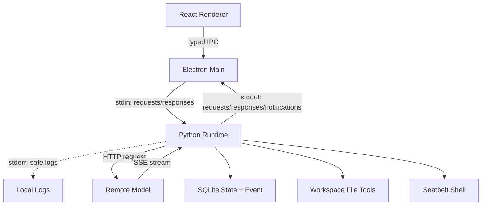

# 总体架构

版本：v0.4（探索草案）

本文描述目标态系统边界。历史 [MVP Lite](../archive/phases/mvp-lite.md) 记录了 stdio JSON-RPC 2.0 的早期验证；当前实现以 `docs/current-*.md`、代码和测试为准。

当前实现已具备 Renderer/Preload/Main/Python Runtime 四层骨架、双向 JSON-RPC、SQLite、远端模型 HTTP/SSE、文件工具、审批和 Seatbelt Shell。目标态章节描述的是演进方向，不表示模块已经全部落地。

## 1. 技术目标

构建一个仅支持 macOS 的本地 Agent Runtime，优先保证主链路可运行、可审批、可追踪、可恢复：

```text
Renderer -> typed IPC -> Electron Main
         -> stdio JSON-RPC -> Python Runtime
         -> HTTP/SSE -> Remote Model Provider
         -> Tool Registry -> Workspace Guard / Seatbelt
         -> SQLite State + Event Timeline
```

系统是单用户、单机、单 sidecar、单执行器。可以持久化多个 Run，但模型调用和工具执行不并行。

## 2. 技术选型

| 层 | 选型 | 说明 |
|---|---|---|
| Desktop | Electron + React + TypeScript | Workbench、审批、Diff、Artifact 和 Timeline |
| Local Control | JSON-RPC 2.0 over stdio/JSONL | Main 与 Runtime 的唯一控制通道；支持双向请求和通知 |
| Runtime | Python 3 + Pydantic v2 边界模型 | Agent Loop、状态机、模型与工具；Pydantic 不替代业务状态机 |
| Persistence | SQLite + 显式事务与前向 migration | 本地状态、队列、审批与 Event；是否引入 ORM 留到出现真实收益时决定 |
| Remote Model | HTTP client + SSE decoder | 模型请求和流式响应；Provider 事件先归一化 |
| Shell Sandbox | `/usr/bin/sandbox-exec` + Seatbelt policy | macOS 进程级文件和网络隔离 |
| Tool Network | Eidos managed proxy（后续能力） | 仅约束获批 ToolCall 网络，不承载本地控制面 |

不引入 Rust、Redis、PostgreSQL、Docker、内嵌 PTY、后台 daemon 或本地 Web 服务。

## 3. 进程架构



Electron Main 负责 sidecar 生命周期、JSON-RPC 客户端/服务端分流、类型化 IPC、文件夹选择和系统 Terminal。Runtime 负责 Scheduler、RuntimeEngine、Model Gateway、Tool Registry、Approval、Sandbox、Recovery、Redaction 和 Repository/Event Outbox。

## 4. 信任边界

### 4.1 Renderer

Renderer 处理模型生成的 Markdown、代码和链接，属于不可信展示层：

- 不直接持有 Runtime stdin/stdout，也不直接访问本地文件或进程。
- 只能调用 Preload 暴露的命名方法，不能传入任意 IPC channel。
- 只消费 Main 二次验证后的闭合 DTO，不消费 Provider 原始响应或 Runtime 自由字典。

### 4.2 Electron Main

Main 是 Desktop 权限边界和 Runtime 唯一客户端：

- 取得 Electron single-instance lock 后拉起唯一 sidecar，并持有其 stdin/stdout/stderr。
- 校验每个 JSON-RPC envelope、方向、request id、method、消息大小和协议版本。
- stdout 出现日志、banner、非法 JSON 或未知 response id 时终止当前 Runtime，不能猜测恢复 framing。
- 将 Runtime 请求和通知投影到固定 Preload API；不实现 Agent Loop，不执行 Agent Shell。
- 用户点击时调用文件夹选择器或打开系统 Terminal。

父子进程和私有 pipe 是本地通道的身份边界，因此不再额外生成端口 Token。协议安全依赖单实例、状态目录锁、不可继承的 pipe/fd、闭合 schema 和严格生命周期，而不是 CORS 或 Bearer 认证。

### 4.3 Python Runtime

Runtime 是受信任控制器，但用户输入、模型输出和 ToolCall 参数均不可信：

- JSON-RPC Server 只做 framing、初始化 gate、闭合 DTO 校验和方法分派。
- RuntimeEngine 是 Agent Loop 唯一入口；状态迁移、模型运行、工具调度、审批、事件和错误映射各有单一职责。
- Tool Registry 固化模型可见 schema、side effect、审批、timeout 和 ToolResult；Tool Executor 只消费 effective arguments。
- Provider function calling 不是授权边界；本地 schema、安全扫描、状态、审批与 Sandbox 必须全部通过。
- Model Adapter 只做 HTTP/SSE 编解码并输出内部事件；Provider conversation/response 状态不作为事实来源。
- 文件工具经 Workspace Guard；Shell 只通过 Seatbelt 执行，沙箱不可用时 fail closed。
- Runtime 可读取 `~/.eidos`，沙箱子进程不能读取真实 `~/.eidos`。

## 5. 启动与诊断流程

```text
Main acquire Electron single-instance lock
  -> spawn sidecar with private stdio
  -> send initialize {protocolVersion, clientVersion, supported contracts}
  -> Runtime validate ~/.eidos identity and acquire lifetime OS lock
  -> Runtime validate storage revision, backup/migrate and integrity
  -> Runtime reconcile running state, durable intents and FIFO
  -> Runtime self-test Tool Registry, serializers, redaction and Seatbelt
  -> Runtime return initialized {runtimeVersion, contracts, mode, capabilities}
  -> Main validate result and open typed business IPC
  -> scheduler claims the first queued Run only after the same ready gate
```

初始化完成前只接受 `initialize`、`runtime/status`、`runtime/recheck` 和 `runtime/shutdown`。业务请求固定返回 `RUNTIME_NOT_INITIALIZED` 或 `RUNTIME_UNAVAILABLE`，不得读取业务表、占用 operation id、创建 Event 或触发调度。

`initialize` 返回的 `mode=ready|diagnostic`、`phase`、`reasonCode`、协议/Event contract version 和 capability 使用闭合 schema。storage、锁、迁移、核心契约、Redaction 或恢复失败时保持 `diagnostic`；Main 只开放诊断、重新检查和关闭。局部 Shell/Toolchain 故障只把对应 capability 标记为 unavailable，不降级为无保护执行。

状态变化不得通过 stdout 的特殊文本行表达；所有控制消息都是 JSON-RPC response/request/notification。日志只写 stderr，且不得包含异常原文、SQL、用户正文、凭证或未扫描输出。

当前 Tool Contract 或 serializer 自检失败时 Runtime 不进入 ready。升级后若非终态 Run 引用的旧 contract 已不可用或低于当前安全底线，该 Run 零模型/工具执行并进入 `interrupted/runtime_contract_unsupported`。

ToolResult quarantine 跨重启保留。只有对应 deterministic regression vectors 全部通过后才能清除；未清除的 tool scope 从 Step 工具集排除，global scope 禁止全部工具循环。

## 6. Eidos Home

```text
~/.eidos/                         mode 0700
  eidos.db
  runtime.lock                    OS lock authority; file content is diagnostic only
  config.toml                     mode 0600
  emergency.reserve              mode 0600; >=16 MiB allocated, same filesystem as DB
  backups/                        mode 0700; migration backups and manifests
  public/sessions/{session_id}/
    files/
    artifacts/{artifact_id}/
  workspaces/{workspace_id}/
    workspace.toml
    sessions/{session_id}/
      artifacts/{artifact_id}/
  sandbox/
    homes/{tool_call_id}/
    tmp/{tool_call_id}/
    cache/{tool_call_id}/
    manifests/{tool_call_id}/{execution_nonce}/
    guardian-leases/{tool_call_id}/{execution_nonce}.json
  logs/
```

- Workspace 业务文件仍在用户选择的目录。
- Artifact 目录保存不可变快照，不保存动态链接。
- ToolCall 沙箱目录在调用结束后可清理；审计元数据保存在数据库。
- MVP 不自动清理 Public files、Artifact、Event 和日志。

## 7. 代码目录建议

```text
Eidos/
  desktop/
    main/
    preload/
    renderer/
  runtime/app/
    protocol/
    db/
    scheduler/
    runtime/
    model/
    tools/
    sandbox/
    network/
    approval/
    artifacts/
    events/
    security/
  runtime/resources/seatbelt/
  tests/runtime/
  tests/desktop/
  docs/
```

Seatbelt profile 作为只读资源随 sidecar 打包。策略模板、参数绑定和 Shell 启动必须集中在 `sandbox/`，禁止业务代码自行 spawn Agent 命令。

### 7.1 第二期 RuntimeEngine 模块

第二期把现有 `eidos_runtime.runtime.loop.RuntimeLoop` 演进为 `eidos_runtime/runtime/` 包。目标是责任与测试 seam 的拆分，不是按行数切分文件；`RuntimeEngine.run(run_id, cancel)` 是 JSON-RPC Server 和测试唯一需要知道的执行接口。

```text
eidos_runtime/runtime/
  loop.py              # RuntimeEngine：装配依赖、驱动一次 Run、无业务分支复制
  state_machine.py     # Run/执行态合法迁移、allowed_actions、迁移原因
  model_runner.py      # 单 Step 的上下文、流、Attempt、模型响应归一化
  tool_dispatcher.py   # ToolSpec 选择、批次校验、effective arguments 与执行分派
  approval.py          # Approval 请求、决策、失效、Reject 计数
  events.py            # 状态事实与 Event 的同事务记录及安全通知投影
  errors.py            # 闭合 Runtime/Tool 错误码与安全映射
```

- `loop.py` 只协调状态机给出的下一步，不直接解析模型流、执行工具或写 Approval/Event。
- `state_machine.py` 是唯一允许从事件推导持久 Run 状态和瞬时 `RuntimeState` 的模块；Storage 仍负责事务与条件更新，不在状态机中嵌入 SQL。
- `model_runner.py`、`tool_dispatcher.py` 和 `approval.py` 只返回闭合结果或领域事件，不能自行把任意字典写入 SQLite、Event 或 Renderer。
- `events.py` 是 Runtime 内部事件 seam，不改变现有 stdio notification 通道；通知必须由已提交的事实投影生成。
- 先迁移 `RuntimeLoop` 的职责与测试，再删除旧模块；不得保留两个可独立运行的 Loop。

## 8. 第三期 Extension Catalog 与 Tool Registry

第三期在既有 RuntimeEngine 内增加两个深模块，不增加第二条 Agent Loop：

```text
extensions/catalog
  input: installed Plugin facts + enabled state + Run snapshot
  output: immutable Plugin/Skill/MCP catalog snapshot

tools/registry
  input: builtin adapters + catalog snapshot + current MCP discovery
  output: immutable ToolRegistrySnapshot and quarantined external entries
```

- Plugin import、Skill 读取和 MCP 连接都在 Runtime 进程；Renderer/Main 不解析 manifest 或重建工具定义。
- Registry entry 同时持有闭合 ToolSpec、执行 Adapter 与 provenance；模型 schema、参数校验、side effect、审批、timeout、batch 和执行不得来自另一份按名称分支。
- 内置 entry 不合法使 Runtime unavailable；单个 Plugin/Skill/MCP entry 不合法只隔离该 entry/source。
- Run 创建时冻结 extension snapshot；Step 在 Provider 请求前冻结 tool snapshot；正在进行的 Step/Attempt 不响应全局 enable/list_changed。
